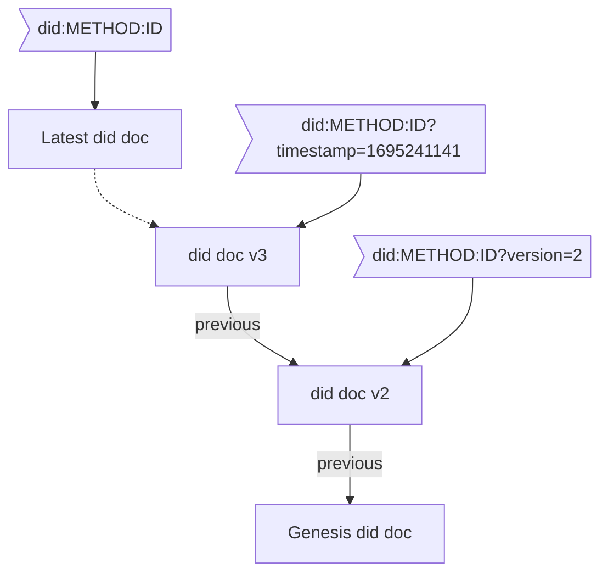

# Beyond did:web

**Responsible/Communicating Author:**
- Mirko Mollik <mirko.mollik@fit.fraunhofer.de>

**Authors:**
- Hans Boone <hans.boone@unifiedpost.com>
- Dan Carez <carezd@gmail.com>
- Jen Schreiber
- Dr. Sebastian Schmittner <sebastian.schmittner@eecc.de>
- Dr. Carsten Stoeker <carsten.stoecker@spherity.com>


## Abstract

:::warning
Clearly say here: We do not define a new did method!
:::

This paper will explore a few recent suggestions for enhancing the did:web method, in particular did:webplus and did:webs. Shortcomings of did:web are analyzed and a list of necessary features to overcome real problems is assembled. We strive to avoid the problem mentioned in the above comic and answer the question, whether the did web method can be improved without creating yet another (few) did methods.


To begin, we will evaluate the current did:web specification. We will use our shared experiences implementing did:web and published articles to create an exhaustive list of the feature set and known gaps or security implications. Understanding business requirements and use cases is important. This paper explains the practical applications and  of businesses needs that did:web aims to fill. A detailed discussion on the features of did:web is presented, drawing from experiences with existing working code and real-world applications.


Additionally, we explore other did:methods that might operate under different names but offer similar functionalities, particularly those that resolve via DNS and incorporate key rotation features. Our focus remains on non-DLT based approaches, ensuring a broader applicability. We also dive into the related standardization activities undertaken by Trust over IP (ToIP) and IETF, highlighting their contributions and guidelines that shape the future of did:web.


Lastly, if needed, we hope to provide a cursory feature set to make the new did:web* the best it can be!


## Introduction

:::warning
- Why are we writing this paper?
- Brief overview of the did:web method and its significance.
- Background and Current State

TODO: Make sure that all of the following points from our group discussion are covered in the following sections:
### Requirements fullfilled in did:web
- Getting did doc is easy
- Trust from TLS + DNS
- did doc updates (but its lacking in supporting multiple versions)


### Lacking /optional/missing in did:web
- integrity check
    - check that the dic  mathes the did ("zero trust")
- access to historical did docs (timestamp, unique identifier)
- "Audit trail"
    - who changed what/when?
    - In the sense of -> which key?
- sequences of did docs
- availability
    - the did doc can only be provided by the DNS, not by some kind or archive or backup CDN because it collides with the match of the DOMAIN and ID matching requirement

:::


### Why are organizations using did:web?

:::warning
- This sections and the following ones content should cover the "Requirements fullfilled in did:web" above.
- likely the next few sections need to be merged
:::

As organizations navigate the evolving landscape of identity management, decentralized identifiers (DIDs) are emerging as a promising solution to enhance security, privacy, and user control. Among the various DID methods available, 'did:web' serves as a practical starting point for those venturing into this decentralized realm. Easy to implement and compatible with existing web infrastructure, 'did:web' enables organizations to familiarize themselves with the core concepts of decentralized identities before diving into more complex and specialized DID methods. Below, we explore the key advantages of starting with 'did:web'.

**Ease of Use**: 'did:web' is often considered simpler to understand and implement. It operates over standard HTTPS protocols and can be easily managed with familiar, widely available and cheap web server technology.

**Simple discoverability**
Unlike ledger based did methods resolving the did document for did:web is straightforward. Discovering and resolving the did:web did document relies on proven DNS technology *) 

**No Specialized Infrastructure**: Unlike some other DID methods that require special nodes or decentralized networks, 'did:web' works on existing web infrastructure.

**Low Cost**: Unlike ledger based did methods, 'did:web' does not have an associated cost other than maintaining a web server.

**Interoperability**: 'did:web' identifiers can be easily mapped to existing HTTPS URLs, making it straightforward to integrate with current web architectures.

### Main criticisms ###

:::warning
This section should cover the points from "Lacking /optional/missing in did:web" from above.

To do: discuss did:dns improved binding between the dns and the did document
:::

Although did:web is easy to use and provides a good starting point into the decentralised identity space, using did:web also has some limitations, the 3 most prominent limitations being:
1) No trustworthiness
2) historial did document resolution
3) No did document integrity check

**No trustworthiness**
The main criticism of the did:web method for decentralized identities is its inability to provide trustworthiness over the information it handles. While did:web is beneficial for publishing and discovering DID documents, using familiar web mechanisms for this purpose is not suited for evaluating their trustworthiness. The current web infrastructure is rife with vulnerabilities like website hacking, DNS hijacking, and unreliable certificate authorities. 

Did:web method relies on DNS and TLS as trust anchors. While DNS resolves the domain name to an IP address and TLS secures the transport mechanism, they do not necessarily enhance the trustworthiness of the information. TLS merely verifies that the Fully Qualified Domain Name matches the common name in the certificate. Various levels of assurance can be achieved through different types of TLS certificates, ranging from 'no assurance' with Let's Encrypt, to 'medium assurance' with extended validation certificates, and 'high assurance' with QWAC certificates. 

Even with different levels of assurance offered by various TLS certificates, this information is not factored into the trustworthiness of the did document content. This is because in the current did:web method specification, the did document itself does not require information about the type of TLS certificate and its corresponding level of assurance.

**Historical did document resolution**
If a private key linked to a DID:WEB did document becomes lost, compromised, or outdated, it's essential to rotate the existing keys and associate a new key with the DID. The goals of this key rotation are threefold: to maintain the validity of prior signatures, nullify any signatures made with the faulty key, and enable the DID controller to produce new signatures using the updated key. 

In the order to prove the validity of prior signatures it's essential to be able to retrieve a did document that was valid in a particular moment of time. In order to prove that the controller is still the same an inmutable link between the different versions of the did documents is required.

While the DID:WEB specification allows for key rotation and historical versions, it doesn't fully address all of the issues mentioned above.

**DID document integrity**
In the existing did:web specification, self-signing the did document is not mandated. As a result, it becomes impossible to ascertain whether the content of the did document is intact and unaltered or if it has been compromised.

### Beyond did:web  ###

This paper aims to critically examine the most glaring drawbacks of the current did:web implementation: namely, the lack of trustworthiness, absence of key rotation mechanisms, and concerns about did document integrity. To address these limitations, we will analyze two existing works that attempt to rectify these issues: the did:webplus and did:webs specifications. Through this analysis, we will assess how these specifications tackle the inherent shortcomings of did:web. Moreover, we will propose an alternative solution that enhances the existing did:web specification in a fully compliant manner, targeting the rectification of the aforementioned drawbacks.


:::warning

TODO:
**Main issue that we're trying to address**: ...

:::

## Feature requests: What is did:web lacking

:::warning
- Attacks/Failure scenarios
    - Enhancing Security in did:web
- Missing Features
:::

### Recover a did if the private key has gone bad

In case a private key gets
- lost, i.e. is no longer available to the legitimate owner but likely also not to anybody else
- compromised, i.e. accessible by an unauthorized actor
- out dated, e.g. because the key length or, more generally, the algorythem used are no longer considered secure enough

a did needs to be associated with a new key pair. Such that

- Signatures by the did before the private key went bad remain valid
- Signatures by the did's bad key after it went bad are to be considered invalid
- The did can still signe (with a new key)

This applies in particular for VCs issued by the did, but also to e.g. presentations signed by the did.


### Add/change/delete a service endpoint to a did document

Service endpoints provided by a did might change over time, hence a typical did document update not related to cryptografic material is changing the list of published service endpoints


### Practical business applications and feature requirements of businesses in relation to did:web.


### DID:web auditability 
:::warning
**Carsten**
- Potential benefits and challenges of integrating GIT with did:web.
:::

## Solving Problems

:::warning
**Sebastian**

Proposed solutions and methods to enhance security.
Recommendations and Roadmap
:::

### Key Rotation

When [the private key of a did becomes unusable](#Private-Key-gone-bad), the did document needs to be updated to publish a new public key. In order to fulfill the [requirements listed above](#Private-Key-gone-bad), the old private key must still be accessible, but it must be made clear signatures from which time period are still to be considered valid and from where they are to be considered invalid.

Having a version history of keys inside a did document with published validity intervals is a perfectly valid solution to this problem and could be achieved by simply adding `valid-from` and `valid-until` time stamps to the did documents verification methods. (See [did core specification of verification methods](https://www.w3.org/TR/did-core/#verification-methods))

However, since key rotation is only one reason to change a did document, we conclude that rather than coming up with a way to only having a version history of keys, we would rather have [versioned did documents](#Did-Document-Versioning).

### Did Document Versioning - Micro Ledger Approach

The best:tm: approach to versioning is what is nowadays known as a "micro ledger", i.e. hash linked data blocks. Notice that this is the data structure used in a block chain, but none of the methods discussed in this paper actually uses a distributed ledger to store/share the data.

- did:webs uses KERI to have this micro ledger in form of an KERI event log.
- The did web 2.0 proposal has the backward links as resolvable did URIs, including the hash (id), directly in the did document in a new `"previous"` field.
- did:webplus links to the privious did doc via including a `prevDIDDocumentSelfSignature` field, which is the most traditional form of linking the blocks found e.g. in the bitcoin data structure


In the did:webs approach, the did documents are generated by processing the full or partial KERI log. To get a historical version by version id/time stamp, only the KERI log up to this time/version is processed to generate the historical did document. The did documents themselves do not maintain any of the micro ledger structure in did:webs.

In contrast, did:webplus builds the micro ledger directly from the did documents. The did web 2.0 proposal is very similar to did:webplus in this respect.


#### Referencing versions

We have to distinguish between 
- The did being an identifier of an entity (person/organisation/thnig/...)
- The did being a resolvable URI which yields a did document
    - The did document at least associates public key(s) with the did
    - Usually the did document also publishes service endpoints which allow others to discover how to interact with the dids subject


When the did is used to refer to a did document, mentioning the version of that document might be necessary. This could be specified in the form of a version number/hash id (see [naming things with hashes](https://www.rfc-editor.org/rfc/rfc6920.html) for the general idea, there a lots of concrete variants on the theme). 

A very important use case for accessing a historical did document is this:
When verifying a credential, the verifier does most likely not want to get the latest version of the issuers did doc, but the version that was current at the time he issued the credential.




## Summary of did:web improving did methods

This section introduces existing proposals that aim to solve some of the limitations of `did:web`.


### did:webs

The `did:webs` method [3] aims to provide the discoverability of `did:web` while introducing an additional trust mechanism based on a chain of events that leverage some of the mechanisms proposed by KERI (Key Event Receipt Infrastructure) [5].

`did:webs` identifiers follow a structure similar to `did:web`, with an additional *Autonomic Identifier* (AID) derived from a KERI inception event appended to the identifier, for example: `did:webs:example.com:some:path:aid`

The KERI AID is strongly bound to a cryptographic keypair at inception time. The AID is self-certifying and becomes the fist item in the append-only chain of events known as the KEL (Key Event Log). The KEL provides a secure mechanism to perform updates in the DID document that are chained together and can be validated against the inception event that is encoded in the DID itself.

(Talk about how events link with each other)
(Do we want graphics?)

Like `did:web`, `did:webs` uses the HTTPS protocol to provide access to the latest version of the DID document. In addition to it, `did:webs` publishes the entire stream of KEL events on a separate URL, making it possible for DID resolvers to reconstruct and validate the content of the DID document at any point in time.

Since the AID represents the inception event tied to the subject's identity, the AID together with the KEL are suficient to generate the DID document associated with the subject, independently from the `did:webs`'s DID itself. This property makes it possible to, for example, migrate a `did:webs` to another web domain, or even to another DID method by using the AID as the unique identifier and the KERI event stream for validation. From this perspective, `did:webs` could be seen as a method for exposing a set of KERI mechanisms via HTTPS. 

(Briefly mention additional features: whois folder, Witnesses, Signed files, security, ...)


### did:webplus

The `did:webplus` method [4] augments `did:web` by maintaining an immutable and auditable history of DID document versions.

This is realized by implementing a microledger in which the signature of the initial document is incorporated into the DID itself, with each subsequent document referencing the signature of its predecessor.
Documents also contain additional attributes, including a monotonically increasing *version number* and a *start of validity* timestamp, which effectively establish a totally ordered sequence of DID documents with non-overlapping periods of validity.


Identifiers in `did:webplus` are similar to the ones in `did:web`, with an additional field corresponding to the self-signature of the initial document, for example: `did:webplus:example.com:0B2LYBZ06Bn0dq7ALo3kG5ie20sQKvv7yzmbA8KtKExC4PRiZ2io-hPxxOy-mQ2qb4yuGdAK0eKvipqcBlZSArDg`.

When the DID controller produces a signature, the DID URL specifying the signing key must include the standard  query parameters `versionId`, `versionTime` and `hl` [6]. This uniquely identifies the document version within the ledger.

To our knowledge, a draft method specification of `did:webplus` has not yet been published, but an overview of the method and a prototype implementation are available [4].


#### Embedding self-signatures

To uniquely identify and link document versions, a self-signature of the document content is computed and embedded in the document itself. This creates a circular dependency problem: the signature should only be computed once the content will not be further modified, so it is not possible to then modify the document to include the signature inside it.

`did:webplus` solves this problem by reserving "slots" in the document that are filled with zeroes. The signature is then generated on this data, and the zeroes are then replaced with the computed signature to build the final self-signed structure.
During the signature verification process the inverse operation is performed, extracting the signature first, then filling the slots with zeroes and computing the signature.


(More features: authorization)


:::danger
### DID Web 2.0
We will state that the ideas from the did web 2.0 advance reading paper are pretty implemented in in did:webplus and obviously webplus is much further in terms of spelling things out, so we focus on this one.
:::


## DID Web with attached validation
During the Rebooting Web of Trust event we also tried to find a way to make the did documents verifiable without breaking the actual schema of a valid did:web document like `did:webplus` is doing. Another requirement was to just use technologies that have already a high adoption.

The did:web can be used either as the issuer in the credential or as the holder/owner.

### Using the DID to identify the issuer of a verifiable credential

In this case the verifier needs access to the public key, even when the private key is not actively used to sign new credentials anymore. To make this possible, the issuer has to add either the [versionId](https://www.w3.org/TR/did-spec-registries/#versionId-param) or [versionTime](https://www.w3.org/TR/did-spec-registries/#versionTime-param) [query paramter](https://www.w3.org/TR/did-core/#did-parameters) to its identifier. It would look something like this: `did:web:example.com?versionId=2` or `did:web:example.com?versionTime=2023-09-21T10:08:26.047Z`. This allows to have multiple versions of a did document and therefore to update the key material or the service points.


To guarantee the [content integrity protection](https://www.w3.org/TR/did-core/#content-integrity-protection), the issuer adds a [hashlink](https://datatracker.ietf.org/doc/html/draft-sporny-hashlink-05) of the did document to the identifier. The final identifier looks like this `did:web:example.com?versionId=2&hl=zQmWvQxTqbG2Z9HPJgG57jjwR154cKhbtJenbyYTWkjgF3e`.


After checking the integrity of the did document we need to make sure that the used public key was valid during the issuance process. Compared to other formats, like X509 certificates, did documents do not have fields defining the lifespan of a did document and the validity of the content. To solve this problem, we can use the [did document metadata](https://www.w3.org/TR/did-core/#did-document-metadata). In this object the field [nextUpdate](https://www.w3.org/TR/did-spec-registries/#nextupdate) can include a time stamp. If so, a newer version of the did document exists and this time stamp has to be compared with the issuance date inside the credential. If the date inside the credential is greater than the date of the `nextUpdate` field, the signature is invalid. To query the metadata, we need to add a service endpoint to the did document like:
```
{
  "service": [
    {
      "id": "did:web:example.com#metadata",
      "type": "didDocumentMetadata",
      "serviceEndpoint": "https://example.com/metadata"
    }
  ]
}
```
A `versionId` or `versionTime` query can be passed to the endpoint to get the did document metadata for a specific version. If none is passed, the metadata from the latest did document are returned. The type `didDocumentMetaData` is not yet included in the [Did spec registry](https://www.w3.org/TR/did-spec-registries/#service-types). Using the metadata endpoint we are not required to define the `versionId` as an increment number to discover the next version. The value [nextVersionId](https://www.w3.org/TR/did-spec-registries/#nextversionid) is giving us this information we need to request the next version if there is any. If we get none, we can be sure to have the latest version of the did document.

Using only the already defined paramters from the did-core, we don't need to add extra fields to the did document. So beeing compliant to the schemas `"https://www.w3.org/ns/did/v1", "https://w3id.org/security/suites/jws-2020/v1"` that are used by the `did:web`, we are not forced to create a new did method like `did:webplus` It also reduces the the required requests we need to make to the server, since we only request one version of the did document and its metadata.

### Using the DID as the subject id

The method can also be used as a subject inside a verifiable credential. Since we can make key rotation, the identifier has to include a reference to the version with `versionTime` and `versionId` and also the hashlink for integrity protection. As long as there is no newer version of the did document, the verifier just requests the did document and the metadata in the same way when the method is used as an issuer. But in case the holder rotated its keys, it is not able to proof the ownership with one of the keys that where in the linked version when setting the subject. It only has access to the current private key of the last did document version, so we need a connection from the linked version to the latest one. A new did document does not know the content of the next version, so we can not prelink it via a hash. But we are able to sign a credential with claiming what is the next did document version. The credential is a JSON Web Token, including the hash of the next version and signed by the current version:
```
Payload
{  
  // hashlink of the next version, in this case version 8
  "sub": "c4c09b07e9c46fae3d53bc9282425d0a8b4025e0dbce2a8dc176ce1912c88983",
  // reference to the key used for signing
  "iss": "did:web:example.com?versionId=7#key-0"
}
```
We do not need to include a hashlink in the issuer reference since we already validate this document. To follow the principles of least privilege we can limit the usage of possible keys by defining that these credentials should be signed by a keys that is in the list for [authentication](https://www.w3.org/TR/did-core/#authentication)
To get access to the signed credentials, one more service endpoint has to be defined where the credentials are stored:
```
{
  "service": [
    {
      "id": "did:web:example.com#proofs",
      "type": "UpdateProofs",
      "serviceEndpoint": "https://example.com/proofs"
    }
  ]
}
```

The endpoint will either return a list of all proofs or just the proof that is required to validate the next version. In case one of the signature is invalid, the whole chain of trust is broken and the validation process has failed.

### Known drawbacks

The storage of did documents needs more space than just storing the changes in case only one key is rotated but the other nine keys are still included. Is is a downside for the owner of the did but also for the holder. It has to request all did documents step by step instead of downloading all did documents in a list. This could be done via another service endpoint, requesting a list of did documents and proofs so it can be validated online.

In some scenarios the amount of validation can be huge when the holder had made a lot of key rotations after it got its credential. For this case it would be more effective to make jumps in the chain of versions. But to do so, the owner has to sign a claim that version five is in the trust chain of version two, when it got signed by a key of version two. But this would violate the lifespan of the key from version two since it got rotated when creating version three. And it's also not good practice to not rotate the key that is allowing to update a did document.


## Evaluation & Comparison of methods

:::warning

Convert this:
https://docs.google.com/spreadsheets/d/1xOG_bAHKdM696c1bDoovN0GFMyDaw2z0hChdfTfR3o0/edit?usp=sharing

into text. Try to extract a concise/simple/small table in the end

:::


:::danger

### did:webs compatibility with did:web

from https://trustoverip.github.io/tswg-did-method-webs-specification/ :
> The did:web version of the DIDs are the same (minus the s) and point to the same did.json file, but have no knowledge of the did.keri file.

### did:webplus
### did:web2.0
- uses a new verification relationship "recover"
- self cerififying is covered via the hash value, instead of using the [hashlink](https://www.w3.org/TR/did-core/#content-integrity-protection)
- new field to point to the previous field. This feature seems not to be relevant for an case (personal opinion)

Why are there new did methods?

how can we just improve did:web without making a new did method?
- the deletion/deactivation method of the current did:web forces you to delete the did.json file. In case the user only wants to deactivate the key, but still allow the public key to be available for signature verification, the deactivate status has to be requested via the documented metadata. The did core specification is [mentioning](https://www.w3.org/TR/did-core/#did-document-metadata) that when a did document is revoked, the `revoked` value in the document metadata should be set to `true`. This can only be achieved when the `did.json` file is served dynamically, otherwise we are not able to fetch the metadata.
:::


## Outlook / Future Research

In this paper we did a high level comparison of the did:webs and did:webplus method and compared it to what we think would be possible to achieve with augmented did:webs alone. We did deliberately not do a deep comparison of e.g. performance KPIs of the involved algorithms, neither is this a solid security analysis of any of the mentioned methods. Such a more thorough analysis of the methods is left for future research.


## Acknowledgements

We would like to thank Dmitri Zagidulin, Benjamin Goering, and Juan Caballero for writing [the advance reading paper "DID Web 2.0" for RWOT 12](https://github.com/WebOfTrustInfo/rwot12-cologne/blob/main/advance-readings/did-web-2.0.md) which sparked the work on this paper at RWOT 12.

We would also like to thank all the organizers of RWOT 12 for organizing and facilitating this great conference which enabled us to work on this paper.


## References

[1] did:web method https://w3c-ccg.github.io/did-method-web/  
[2] Zagidulin, Goering, Caballero: RWOT 12 advance reading paper "DID Web 2.0"https://github.com/WebOfTrustInfo/rwot12-cologne/blob/main/advance-readings/did-web-2.0.md  
[3] did:webs method https://trustoverip.github.io/tswg-did-method-webs-specification  
[4] did:webplus method https://github.com/LedgerDomain/did-webplus  
[5] Key Event Receipt Infrastructure (KERI) https://weboftrust.github.io/ietf-keri/draft-ssmith-keri.html  
[6] Did Core W3C Specification https://www.w3.org/TR/did-core/  

