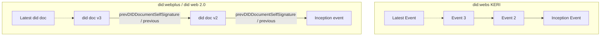

# Beyond did:web

**Authors:**
- Hans Boone <hans.boone@unifiedpost.com>
- Dan Carez
- Mirko Mollik <mirko.mollik@fit.fraunhofer.de>
- Jen Schreiber
- Dr. Sebastian Schmittner <sebastian.schmittner@eecc.de>
- Dr. Carsten Stoeker <carsten.stoecker@spherity.com>

## Abstract


This paper will explore a few recent suggestions for enhancing the did:web method, in particular did:webplus and did:webS. Shortcomings of did:web are analyzed and a list of necessary features to overcome real problems is assembled. We strive to avoid the problem mentioned in the above comic and answer the question, whether the did web method can be improved without creating yet another (few) did methods.


To begin, we will evaluate the current did:web specification. We will use our shared experiences implementing did:web and published articles to create an exhaustive list of the feature set and known gaps or security implications. Understanding business requirements and use cases is important. This paper explains the practical applications and  of businesses needs that did:web aims to fill. A detailed discussion on the features of did:web is presented, drawing from experiences with existing working code and real-world applications.


Additionally, we explore other did:methods that might operate under different names but offer similar functionalities, particularly those that resolve via DNS and incorporate key rotation features. Our focus remains on non-DLT based approaches, ensuring a broader applicability. We also dive into the related standardization activities undertaken by Trust over IP (ToIP) and IETF, highlighting their contributions and guidelines that shape the future of did:web.


Lastly, if needed, we hope to provide a cursory feature set to make the new did:web* the best it can be!


## Introduction

:::warning
- Why are we writing this paper?
- Brief overview of the did:web method and its significance.
- Background and Current State
:::


### Why are organizations using did:web?

As organizations navigate the evolving landscape of identity management, decentralized identifiers (DIDs) are emerging as a promising solution to enhance security, privacy, and user control. Among the various DID methods available, 'did:web' serves as a practical starting point for those venturing into this decentralized realm. Easy to implement and compatible with existing web infrastructure, 'did:web' enables organizations to familiarize themselves with the core concepts of decentralized identities before diving into more complex and specialized DID methods. Below, we explore the key advantages of starting with 'did:web'.

**Ease of Use**: 'did:web' is often considered simpler to understand and implement. It operates over standard HTTPS protocols and can be easily managed with familiar, widely available and cheap web server technology.

**Simple discoverability**
Unlike ledger based did methods resolving the did document for did:web is straightforward. Discovering and resolving the did:web did document relies on proven DNS technology *) 

**No Specialized Infrastructure**: Unlike some other DID methods that require special nodes or decentralized networks, 'did:web' works on existing web infrastructure.

**Low Cost**: Unlike ledger based did methods, 'did:web' does not have an associated cost other than maintaining a web server.

**Interoperability**: 'did:web' identifiers can be easily mapped to existing HTTPS URLs, making it straightforward to integrate with current web architectures.

### Main criticisms ###

Although did:web is easy to use and provides a good starting point into the decentralised identity space, using did:web also has some limitations, the 2 most prominent limitations being:
1) No trustworthiness
2) historial did document resolution
3) No did document integrity check

**No trustworthiness**
The main criticism of the did:web method for decentralized identities is its inability to provide trustworthiness over the information it handles. While did:web is beneficial for publishing and discovering DID documents, using familiar web mechanisms for this purpose is not suited for evaluating their trustworthiness. The current web infrastructure is rife with vulnerabilities like website hacking, DNS hijacking, and unreliable certificate authorities. 

Did:web method relies on DNS and TLS as trust anchors. While DNS resolves the domain name to an IP address and TLS secures the transport mechanism, they do not necessarily enhance the trustworthiness of the information. TLS merely verifies that the Fully Qualified Domain Name matches the common name in the certificate. Various levels of assurance can be achieved through different types of TLS certificates, ranging from 'no assurance' with Let's Encrypt, to 'medium assurance' with extended validation certificates, and 'high assurance' with QWAC certificates. 

Even with different levels of assurance offered by various TLS certificates, this information is not factored into the trustworthiness of the did document content. This is because in the current did:web method specification, the did document itself does not require information about the type of TLS certificate and its corresponding level of assurance.

**Historical did document resolution**
If a private key linked to a DID:WEB did document becomes lost, compromised, or outdated, it's essential to rotate the existing keys and associate a new key with the DID. The goals of this key rotation are threefold: to maintain the validity of prior signatures, nullify any signatures made with the faulty key, and enable the DID controller to produce new signatures using the updated key. 

In the order to prove the validity of prior signatures it's essential to be able to retrieve a did document that was valid in a particular moment of time. In order to prove that the controller is still the same an inmutable link between the different versions of the did documents is required.

While the DID:WEB specification allows for key rotation and historical versions, it doesn't fully address all of the issues mentioned above.

**DID document integrity**
In the existing did:web specification, self-signing the did document is not mandated. As a result, it becomes impossible to ascertain whether the content of the did document is intact and unaltered or if it has been compromised.

### Beyond did:web  ###

This paper aims to critically examine the most glaring drawbacks of the current did:web implementation: namely, the lack of trustworthiness, absence of key rotation mechanisms, and concerns about did document integrity. To address these limitations, we will analyze two existing works that attempt to rectify these issues: the did:webplus and did:webs specifications. Through this analysis, we will assess how these specifications tackle the inherent shortcomings of did:web. Moreover, we will propose an alternative solution that enhances the existing did:web specification in a fully compliant manner, targeting the rectification of the aforementioned drawbacks.


:::danger
probably to be deleted:

- did:peer https://identity.foundation/peer-did-method-spec/#method-name
- DID:github https://github.com/decentralized-identity/github-did
- DID:gitN https://github.com/dhuseby/did-git-spec/blob/master/did-git-spec.md
- Well Known DID: https://identity.foundation/.well-known/resources/did-configuration/
- did:key https://w3c-ccg.github.io/did-method-key/
- did:jwk https://github.com/quartzjer/did-jwk/blob/main/spec.md

:::

:::warning

TODO:
**Main issue that we're trying to address**: ...

:::

## Feature requests: What is did:web lacking

:::warning
- Attacks/Failure scenarios
    - Enhancing Security in did:web
- Missing Features
:::

### Recover a did if the private key has gone bad

In case a private key gets
- lost, i.e. is no longer available to the legitimate owner but likely also not to anybody else
- compromised, i.e. accessible by an unauthorized actor
- out dated, e.g. because the key length or, more generally, the algorythem used are no longer considered secure enough

a did needs to be associated with a new key pair. Such that

- Signatures by the did before the private key went bad remain valid
- Signatures by the did's bad key after it went bad are to be considered invalid
- The did can still signe (with a new key)

This applies in particular for VCs issued by the did, but also to e.g. presentations signed by the did.


### Add/change/delete a service endpoint to a did document

Service endpoints provided by a did might change over time, hence a typical did document update not related to cryptografic material is changing the list of published service endpoints


### Practical business applications and feature requirements of businesses in relation to did:web.


### DID:web auditability 
:::warning
**Carsten**
- Potential benefits and challenges of integrating GIT with did:web.
:::

## Solving Problems

:::warning
**Sebastian**

Proposed solutions and methods to enhance security.
Recommendations and Roadmap
:::

### Key Rotation

When [the private key of a did becomes unusable](#Private-Key-gone-bad), the did document needs to be updated to publish a new public key. In order to fulfill the [requirements listed above](#Private-Key-gone-bad), the old private key must still be accessible, but it must be made clear signatures from which time period are still to be considered valid and from where they are to be considered invalid.

Having a version history of keys inside a did document with published validity intervals is a perfectly valid solution to this problem and could be achieved by simply adding `valid-from` and `valid-until` time stamps to the did documents verification methods. (See [did core specification of verification methods](https://www.w3.org/TR/did-core/#verification-methods))

However, since key rotation is only one reason to change a did document, we conclude that rather than coming up with a way to only having a version history of keys, we would rather have [versioned did documents](#Did-Document-Versioning).

### Did Document Versioning - Micro Ledger Approach

The best:tm: approach to versioning is what is nowadays known as a "micro ledger", i.e. hash linked data blocks. Notice that this is the data structure used in a block chain, but none of the methods discussed in this paper actually uses a distributed ledger to store/share the data.

- did:webs uses KERI to have this micro ledger in form of an KERO event log.
- The did web 2.0 proposal has the backward links as resolvable did URIs, including the hash (id), directly in the did document in a new `"previous"` field.
- did:webplus links to the privious did doc via including a `prevDIDDocumentSelfSignature` field, which is the most traditional form of linking the blocks found e.g. in the bitcoin data structure




In the did:webs approach, the did documents are generated by processing the full KERI log, or the partial KERI log up to a certain version/time, to generate the latest did document or a previous one, respectively. The did documents themselves to not maintain any of the micro ledger structure in did:webs.

In did:webplus, the micro ledger is directly formed by the did documents. The did web 2.0 proposal is very similar in this respect.


#### Referencing versions

We have to distinguish between 
- The did being an identifier of an entity (person/organisation/thnig/...)
- The did being a resolvable URI which yields a did document
    - The did document at least associates public key(s) with the did
    - Usually the did document also publishes service endpoints which allow others to discover how to interact with the dids subject


When the did is used to refer to a did document, mentioning the version of that document might be necessary. This could be specified in the form of a version number/hash id (see [naming things with hashes](https://www.rfc-editor.org/rfc/rfc6920.html) for the general idea, there a lots of concrete variants on the theme). 

A very important use case for accessing a historical did document is this:
When verifying a credential, the verifier does most likely not want to get the latest version of the issuers did doc, but the version that was current at the time he issued the credential.


## Summary of did:web improving did methods
:::warning
Dan
:::

This section introduces existing approaches that aim to solve some of the limitations `did:web`.


### did:webs

The `did:webs` method [3] aims to leverage the discoverability of `did:web` while providing an additional trust mechanism based on a chain of events that leverage the mechanisms introduced by KERI (Key Event Receipt Infrastructure) [5].

`did:webs` identifiers follow a structure similar to `did:web`, with an additional *Autonomic Identifier* (AID) derived from a KERI inception event appended to the identifier.
Example: `did:webs:example.com:some:path:aid`

The KERI AID is strongly bound to a cryptographic keypair at inception time. The AID is self-certifying and becomes the fist item in the append-only chain of events known as the KEL (Key Event Log).

The KEL provides a secure mechanism to perform updates in the DID document, that can be chained together and validated against the inception event that is encoded in the DID itself.

(talk about how events link with each other)

Like `did:web`, `did:webs` uses the HTTPS protocol to provide access to the latest version of the DID document. In addition to it, `did:webs`
publishes the entire stream of KEL events on a separate URL, making it possible for DID resolvers to validate the current document by processing the stream of changes described in the KEL.

Since the AID represents the inception event tied to the subject's identity, the AID, alongside the KEL, are suficient to generate the subject's DID document, independently from the `did:webs`'s DID itself.
This property makes it possible to, for example, migrate a `did:webs` to another web domain, or even to another DID method by using the AID as the unique identifier and the KERI event stream for validation. From this perspective, `did:webs` could be seen as a method for distributing KERI via HTTPS. 


:::warning
older stuff
- did:webS https://trustoverip.github.io/tswg-did-method-webs-specification
    - did:web + KERI AID
    - keri complexity?
     - nice benefit: Any did:webs can be expressed as a did:web but the inverse is not true–a did:webs MUST include an AID.
        - possibility of using it where did:web is accepted increases adoption, can simply ignore the last qualifier, or some detail.
    - The did:web version of the DIDs are the same (minus the s) and point to the same did.json file, but have no knowledge of the did.keri file.
    -  “walk the KEL” -> not realistc for keys that are constantly rotated...
    -  interesting idea::
        -  https://trustoverip.github.io/tswg-did-method-webs-specification/#the-whois-folder
:::


### did:webplus

- did:webplus https://github.com/LedgerDomain/did-webplus

> - Each DID document is self-signed, having fields "selfSignature" and "selfSignatureVerifier" which define the signature and the public key that verifies the self-signature. The process for verifying a self-signature is explained in the selfsign crate readme.
> - Each DID document has a "versionId" field, which starts at 0 upon DID creation and increases by 1 with each update.
> - Each DID document has a "validFrom" field, defining the timestamp at which the DID document becomes current.


### DID Web 2.0???
- this will be done by Dimitr since he is the author of it and it seems to be very close to did:webplus

### DID Web with attached validation
During the Rebooting Web of Trust event we also tried to find a way to make the did documents verifiable without breaking the actual schema of a valid did:web document. Another requirement was to just technologies that have already a high adoption.

The did:web can be used either as the issuer in the credential or as the holder/owner.

#### As issuer
In this case the verifier needs access to the public key, even when the private key is not activly used to sign new credentials anymore. To make this possible the issuer has to add either the [versionId](https://www.w3.org/TR/did-spec-registries/#versionId-param) or [versionTime](https://www.w3.org/TR/did-spec-registries/#versionTime-param) [query paramter](https://www.w3.org/TR/did-core/#did-parameters) to its identifier. It would look something like this: `did:web:example.com?versionId=2` or `did:web:example.com?versionTime=2023-09-21T10:08:26.047Z`. This allows to have multiple versions of a did and therefore to update the key material or the service points.


To guarantee the [content integrity protection](https://www.w3.org/TR/did-core/#content-integrity-protection), the issuer adds a [hashlink](https://datatracker.ietf.org/doc/html/draft-sporny-hashlink-05) of the did document to the identifier. The final identifier looks like this `did:web:example.com?versionId=2&hl=zQmWvQxTqbG2Z9HPJgG57jjwR154cKhbtJenbyYTWkjgF3e`.


After checking the integrity of the did document we need to make sure that the used public key was valid during the issuance process. Compared to other formats like X509 certificates did documents do not have a fields defining the lifespan of a did document and the validity of the content. To solve this problem, we can use the [did document metadata](https://www.w3.org/TR/did-core/#did-document-metadata). In this object the field [nextUpdate](https://www.w3.org/TR/did-spec-registries/#nextupdate) includes can include a timestamp. If so, a newer version of the did document exists and this timestamp has to be compared with the issuance date inside the credential. If the date inside the credential is greater than the date of the `nextUpdate` field, the signature is invalid. To query the metadata, we need to add a service endpoint to the did document like:
```
{
  "service": [
    {
      "id": "did:web:example.com#metadata",
      "type": "didDocumentMetadata",
      "serviceEndpoint": "https://example.com/metadata"
    }
  ]
}
```
A `versionId` or `versionTime` query can be passed to the endpoint to get the did document metadata for a specifc version. If none is passed, the metadata from the latest did document are returned. The type `didDocumentMetaData` is not yet included in the [Did spec registry](https://www.w3.org/TR/did-spec-registries/#service-types). Using the metadata endpoint we are not required to define the `versionId` as an increment number to discover the next version. The value [nextVersionId](https://www.w3.org/TR/did-spec-registries/#nextversionid) is giving us this information we need to request the next version if there is any. If we get none, we can be sure to have the latest version of the did document.

Using only the already defined paramters from the did-core, we don't need to add extra fields to the did document. So beeing compliant to the schemas `"https://www.w3.org/ns/did/v1", "https://w3id.org/security/suites/jws-2020/v1"` that are used by the `did:web`, we are not forced to create a new did method like `did:webplus` It also reduces the the required requests we need to make to the server, since we only request one version of the did document and its metadata.

#### As subject

The method can also be used as a subject inside a verifiable credential. Since we can make key rotation, the identifier has to include a reference to the version with `versionTime` and `versionId` and also the hashlink for integrity protection. As long as there is no newer version of the did document, the verifier just requests the did document and the metadata in the same way when the method is used as an issuer. But in case the holder rotated its keys, it is not able to proof the ownership with one of the keys that where in the linked version when setting the subject. It only has access to the current private key of the last did document version, so we need a connection from the linked version to the latest one. A new did document does not know the content of the next version, so we can not prelink it via a hash. But we are able to sign a credential with claiming what is the next did document version. The credential is a JSON Web Token, including the hash of the next version and signed by the current version:
```
Payload
{  
  // hashlink of the next version, in this case version 8
  "sub": "c4c09b07e9c46fae3d53bc9282425d0a8b4025e0dbce2a8dc176ce1912c88983",
  // reference to the key used for signing
  "iss": "did:web:example.com?versionId=7#key-0"
}
```
We do not neeed to include a hashlink in the issuer reference since we already validate this document. To follow the principles of least privilege we can limit the usage of possible keys by defining that these credentials should be signed by a keys that is in the list for [authentication](https://www.w3.org/TR/did-core/#authentication)
To get access to the signed credentials, one more service endpoint has to be defined where the credentials are stored:
```
{
  "service": [
    {
      "id": "did:web:example.com#proofs",
      "type": "UpdateProofs",
      "serviceEndpoint": "https://example.com/proofs"
    }
  ]
}
```

The endpoint will either return a list of all proofs or just the proof that is required to validate the next version. In case one of the signature is invalid, the whole chain of trust is broken and the validation process has failed.

#### Known drawbacks

The storage of did documents needs more space than just storing the changes in case only one key is rotated but the other nine keys are still included. Is is a downside for the owner of the did but also for the holder. It has to request all did documents step by step instead of downloading all did documents in a list. This could be done via another service endpoint, requesting a list of did documents and proofs so it can be validated online.

In some szenarios the amount of validation can be huge when the holder had made a lot of key rotations after it got its credential. For this case it would be more effective to make jumps in the chain of versions. But to do so, the owner has to sign a claim that version five is in the trust chain of version two, when it got signed by a key of version two. But this would violate the lifespan of the key from version two since it got rotated when creating version three. And it's also not good practice to not rotate the key that is allowing to update a did document.

## Comparison / Compatibility of did:webs and did:webplus with did:web
:::warning
**Mirko**

working here as well https://hackmd.io/@zB4c1wsuTwO4XFCuAasO4Q/ryvJIN_yp

:::


### did:webs

from https://trustoverip.github.io/tswg-did-method-webs-specification/ :
> The did:web version of the DIDs are the same (minus the s) and point to the same did.json file, but have no knowledge of the did.keri file.

### did:webplus
### did:web2.0
- uses a new verification relationship "recover"
- self cerififying is covered via the hash value, instead of using the [hashlink](https://www.w3.org/TR/did-core/#content-integrity-protection)
- new field to point to the previous field. This feature seems not to be relevant for an case (personal opinion)

Why are there new did methods?

how can we just improve did:web without making a new did method?
- the deletion/deactivation method of the current did:web forces you to delete the did.json file. In case the user only wants to deactivate the key, but still allow the public key to be available for signature verification, the deactivate status has to be requested via the documented metadata. The did core specification is [mentioning](https://www.w3.org/TR/did-core/#did-document-metadata) that when a did document is revoked, the `revoked` value in the document metadata should be set to `true`. This can only be achived when the `did.json` file is served dynamically, otherwhise we are not able to fetch the metadata.


## Results from testing DID:webplus working Rust codebase
:::warning
Carsten
:::

:::danger
## Concrete suggestions for the evolution of did:web.
A phased plan detailing short-term and long-term goals.
Conclusion

## Reiteration of the importance of evolving did:web.
Future prospects and the potential impact on the decentralized identity landscape.
References
:::


## References

[1] did:web https://w3c-ccg.github.io/did-method-web/  
[2] Zagidulin, Goering, Caballero: RWOT 12 advance reading paper "DID Web 2.0"https://github.com/WebOfTrustInfo/rwot12-cologne/blob/main/advance-readings/did-web-2.0.md  
[3] did:webs https://trustoverip.github.io/tswg-did-method-webs-specification  
[4] did:webplus https://github.com/LedgerDomain/did-webplus  
[5] KERI https://weboftrust.github.io/ietf-keri/draft-ssmith-keri.html  https://identity.foundation/keri/did_methods/   
[6] Did Core W3C Specification https://www.w3.org/TR/did-core/  
[7]
