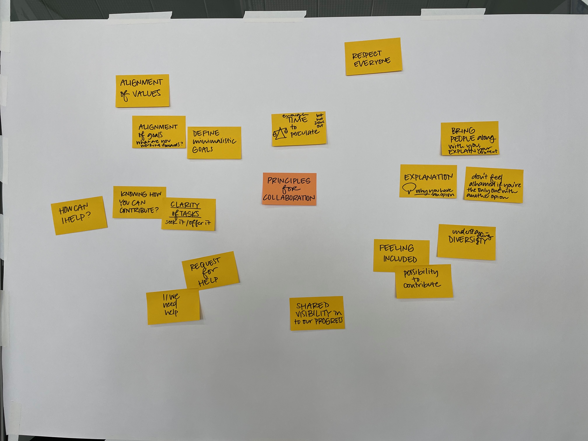

# Principles of Collaboration

_We engaged in one-on-one conversations that allowed us to brainstorm about principles._

What's important to us for collaboration?

* Alignment of Goals
* Clarity of Task
* Alignment of Values
* Shared Visibility into Our Progress
* Feeling of Inclusion
* Explanation of Opinions, Positive or Negative
* Respect
* Minimalistic Goals
* Understanding of Diversity
* Be OK to Ask for Help
* Balance of Time to Be Creative but Not Zone Out
* Bring People Along With You, Explain Contexts

