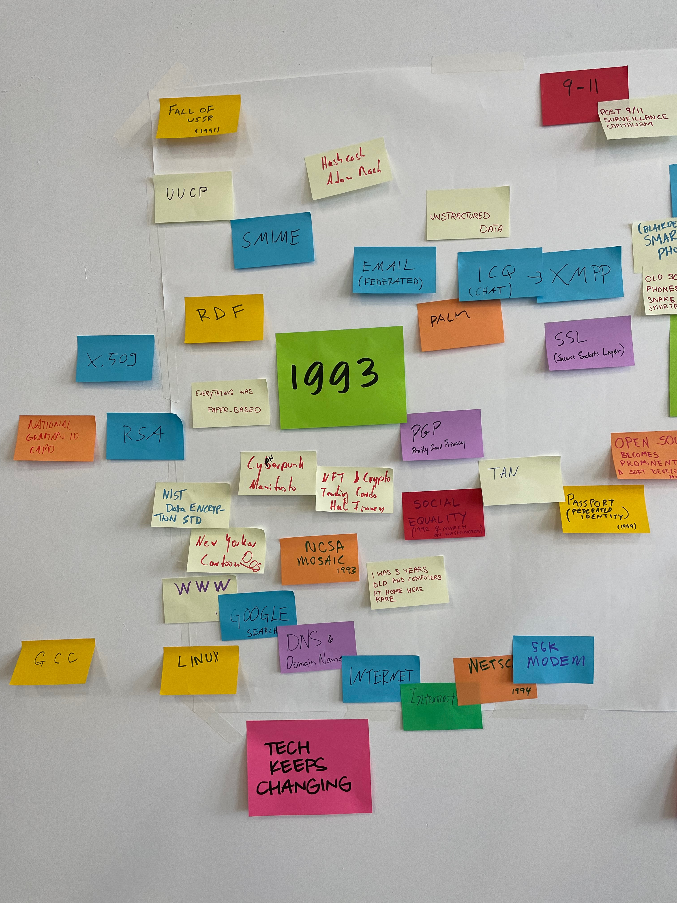
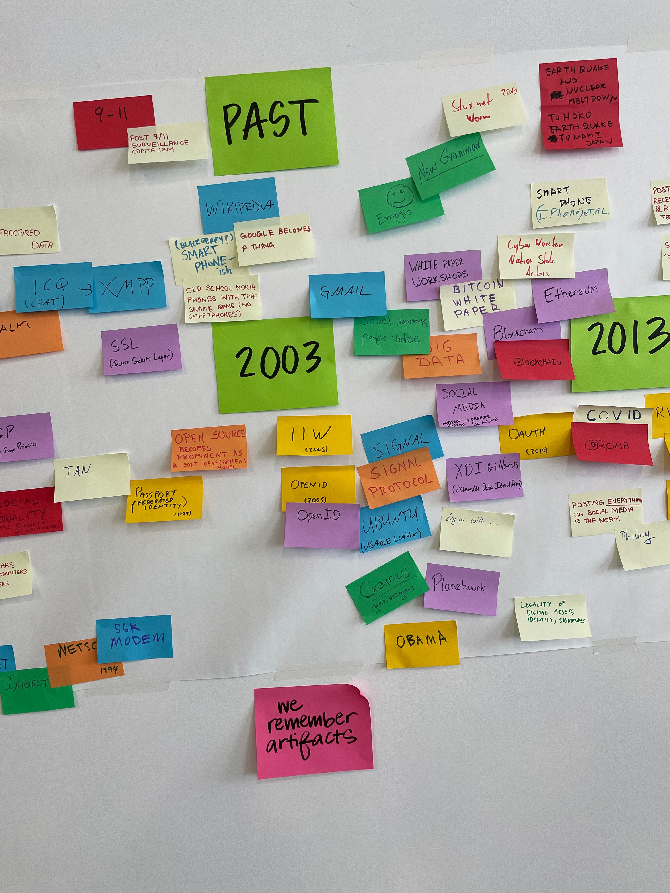
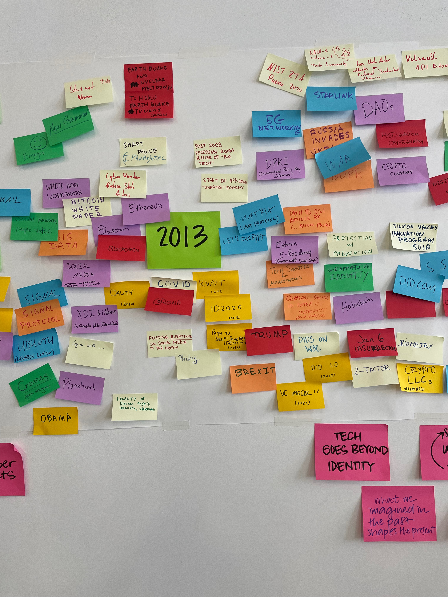
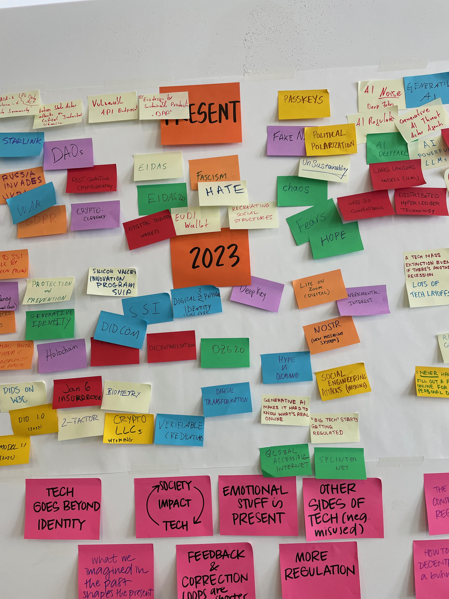
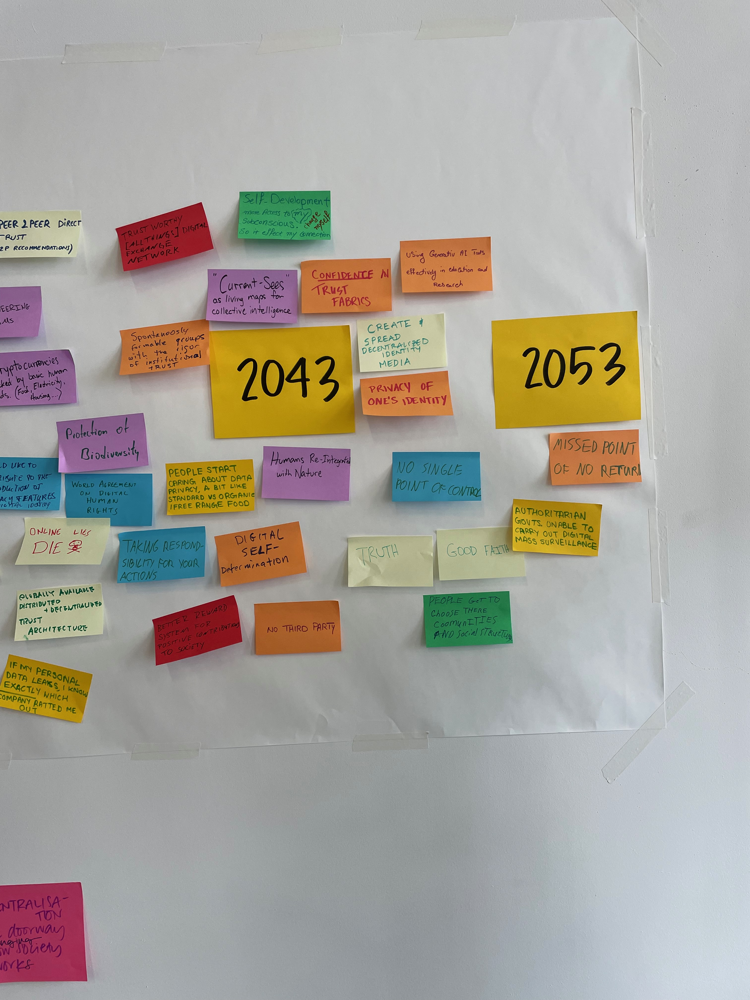

# Timeline Activity

## Thoughts on the Past

We collaboratively created a timeline of events that are important for us. Here were some insights for us:

* The technology keeps changing.
* But the technology goes beyond identity.
* Society impacts tech & tech impacts society.
* And we gathered emotional stuff (like Hate, Fear, Fascism) in the present, not the past.
   * We remember tech, but not the emotions!
* Technology artifacts are long-lived, much more than emotions.
* We see the positive of the past, but more negatives in the future.
* Correction & feedback loop from technology is much faster than it was historically.
* Regulation is coming up in the present.

## Thoughts on the Present

We then talked about what we couldn't have imagined that has changed and what makes things possible. Here were some insights.

* Decentralization is a doorway to recreating how society works.
* What we create is what we were able to imagine in the past.
* We don't know an incentive for how to decentralize.
* We're living in an Age of Wonders.
* Regulations results in crazy consequences that we couldn't imagine.

## Thoughts on the Future

We talked about what changes we'd like to make in the future and then talked about them. They included:

* Digital self-determination. The ability to control how we engage in the digital world as a peer & the ability to spontaneously create new groups with strong trust.
* Digital Human Rights. We need the same rights online that we have physically.
* Where is the ability to be online & ask questions & sharing data and such going in the future, and how can we avoid it being controlled?
* How will communication between people work in future? How effective will it be as we move into Metaverse or other virtual realities?
* Creating value for truth. How do we know that what's on the blockchain is true?
* How can we assure security with an easy user experience?
* A future architecture that is a globally distributed and decentralized trust architecture.
* Tools to allow people to choose their own communities & power relations.
* Self-development and changing ourselves, and only then can digital world help us.
* Communicating expertise in the digital world to support truth.
* Peer-to-peer recommendation.
* Decentralized learning systems that respect & nurture human nature.
* Provenance & trust for bio-diversity.
* TRUTH!
* Tell the stories of what we're working on now.
* Humans integrated with nature.
* Fully peer-to-peer tech.
* Current-cies backed by real human needs.
* Privacy technology becoming commonplace without having to sell on that feature.
* Standards that allow for multiple solutions that can work together.
* Ability to use new cryptographic & privacy protocols so that people don't have to think about them.
* Research & education in the world of digitization.

We had some thoughts on these discussions some looks at patterns & discussions in our future hopes:

* There isn't discussion of generative AI, unlike all the other conferences of 2023.
* We all expressed ideas of using technology for good, but there isn't agreement on what's good.
* Trust & connection between people: if we have all digital information, we can connect it together in a better way.
* People may be using our technology to "social wash"; we should be aware of that!
   * This is similar to the question of what's good!
* There's a shift from institutes as existing power structure to being emergent entities.
* We always have human perspective, but we also need identity from security perspective!
* People can still create technology in a garage!
* The current world is so complicated; we need to think about how to EXPLAIN it.
* The importance of data isn't an implicit truth, but rather its provenance.
   * Can allow risk-scoring, truth-scoring, etc., but truth of data isn't binary.
* People need to be educated because they don't purposefully want to screw up their digital assets, and similar *we* need to be so we don't become super villains.
* Other common themes included:
   * Trust & Information Giving & Individual Agency.
   * Using technology to help nature.
   * Direct connections between people, instead of indirect system-controlled connections. A WEB OF TRUST.
   * Feeling safe and having security in this space.
   * Human-centric.
     
## The Timeline of Past, Present, and Future

