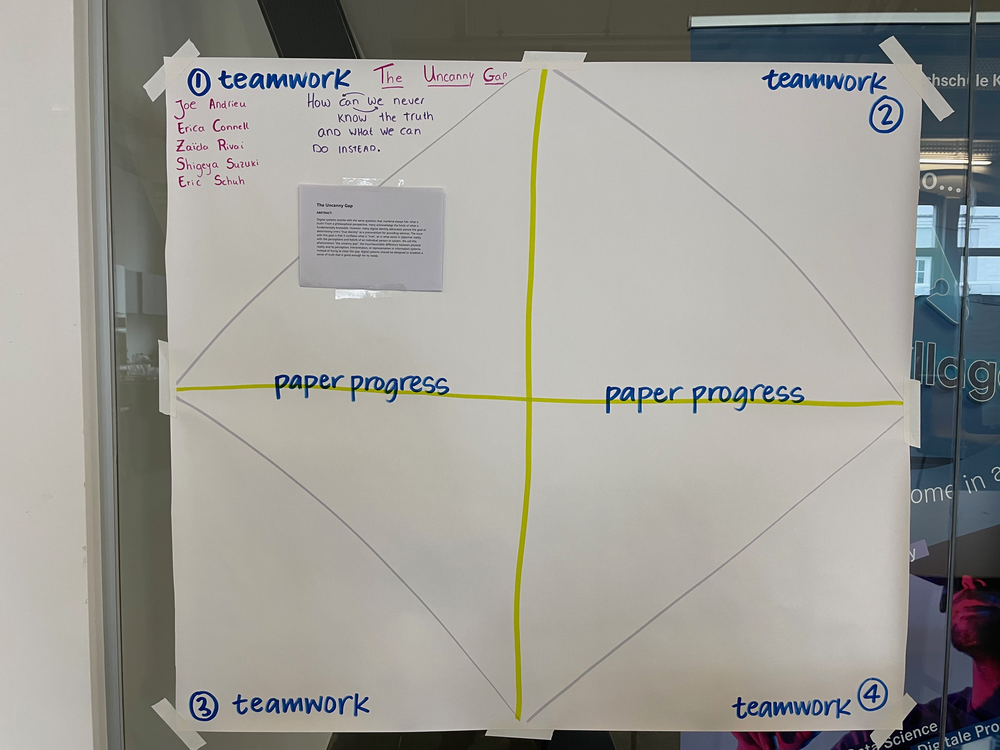

# Day One: Abstracts

## Adding DID Document Updates to DID:Web

**ABSTRACT:**

This paper will explore enhancing the did:web method, compare existing did:web like/enhancing methods (such as did:webplus and did:webS), and propose solutions to elevate its functionality and security. We also aim to provide a phased roadmap for the development of a secure did:web* method, if needed.

To begin, we will evaluate the current did:web specification. We will use our shared experiences implementing did:web and published articles to create an exhaustive list of the feature set and known gaps or security implications. Understanding business requirements and use cases is important. This paper explains the practical applications and  of businesses needs that did:web aims to fill. A detailed discussion on the features of did:web is presented, drawing from experiences with existing working code and real-world applications.

Additionally, we explore other did:methods that might operate under different names but offer similar functionalities, particularly those that resolve via DNS and incorporate key rotation features. Our focus remains on non-DLT based approaches, ensuring a broader applicability. We also dive into the related standardization activities undertaken by Trust over IP (ToIP) and IETF, highlighting their contributions and guidelines that shape the future of did:web.

Lastly, if needed, we hope to provide a cursory feature set to make the new did:web* the best it can be!

## The Uncanny Gap

**ABSTRACT:**

Digital systems wrestle with the same question that mankind always has:
what is truth? From a philosophical perspective, many acknowledge the 
limits of what is fundamentally knowable. However, many digital identity 
advocates pursue the goal of determining one’s “true identity” as a 
precondition for providing services. The issue with this goal is that it 
conflates what is “true”, as in what exists in objective reality, with the 
perceptions and beliefs of an individual person or system. We call this 
phenomenon “the uncanny gap”: the insurmountable difference between physical 
reality and its perception, interpretation, or representation in information 
systems. Instead of trying to close this gap, digital systems should be 
designed to establish a sense of truth that is good enough for its needs. 

## Ecosystem Management

**ABSTRACT:**

Coming at this project from the perspective of an identity wallet provider working to establish a financially sustainable business, the core question is, "Why is it so hard?" 
We are building of a draft piece of work from RWOT11 that looked at [SSI Stakeholder mapping](https://github.com/WebOfTrustInfo/rwot11-the-hague/blob/master/draft-documents/ssi-stakeholder-mapping.md) to understand which components of the ecosystem need to be engaged to make a technical solution work commercially. We aim to define the role of the Ecosystem Coordinator in more detail based on real-world observations. What does an Ecosystem Coordinator need to be and do to make their respective ecosystem work? In which way is a provider's business model influenced by the nature and operations of the Ecosystem Coordinator? Which barriers and accelerators exist in the ecosystem?

_The group is down to two members, so they are trying to decide whether to continue._

## Exchanges through NOSTR for DID Holders

**ABSTRACT:**

Nostr is a simple, open protocol that enables global, decentralized, and censorship-resistant social media.

This paper explains how two DID holders can securely :
- establish end to end encrypted communication channels
- request, issue, present and verify credentials
- send and receive text messages
 
We will provide a simple protocol with partial implementation source code  to ensure this seamless and trusted exchanges.

The protocol follows a series of steps to ensure a seamless and trusted exchange through encrypted messages:

**VP Request**: Verifiers initiate a VP request, specifying the type of VC they require, along with an associated challenge. The VP request is sent to the intended holder.

**Holder Preparation**: Holders receive the VP request and gather the necessary information to prepare the VP. They access the relay service URL provided in the request for further processing.

**VP Encryption**: Holders encrypt the VP using the verifier's public key obtained from the Nostr Verifier's public key repository.

**VP Transmission**: The encrypted VP is securely transmitted from the holder to the verifier via the Nostr relay service.

**VP Decryption**: Verifiers retrieve the encrypted VP and decrypt it using their private key, ensuring confidentiality.

**VP Verification**: The decrypted VP is verified using the holder's public key obtained from the Nostr Verifier's public key repository. This step ensures the authenticity and integrity of the VP.

## Verifiable Presentations of Composed Credentials

**ABSTRACT:**

This paper introduces a novel framework for the presentation of sets of related verifiable credentials that would apply for different purposes; such as infection protection, donation, or education.The framework allows individuals to assemble multiple credentials issued by different issuers and disclose them all together as one claim to stakeholders. By composing credentials together, we can extend the usual pattern of issuer, holder, and verifier. The further challenge is to generate a credible presentation that will be compelling to stakeholders such as regulators, donors, or employers. By bridging the gap between stakeholders and the world of verifiable credentials, we provide a practical and adaptable solution for a wide range of use cases. This holistic exploration of composite credentials demonstrates their potential to address and change the way credentials are presented and verified in a variety of settings.

## Decentralized ID Composer & Threat Models

**ABSTRACT:**

This paper proposes that all digital identity systems are made up of three core elements: digital keys, human-readable names or data; and binding mechanisms between them. This mental model can help establish a shared understanding about the options and trade-offs that developers face when building identity solutions.

Using examples from current identity systems, we illustrate how particular design choices made about the three core elements affect the security & privacy of such systems. We explore a non-exhaustive range of options for each of the core elements, and highlight the benefits and trade-offs in each approach.

Finally, we propose a form of pseudocode configuration definition language that can be used descriptively and succinctly model design decisions. This configuration definition language is also machine-readable, and could be used to configure the set-up and operation of components of decentralized applications.

## Privacy Analysis of Singlebit vs Multibit Status Lists

[offline group that is pending]

