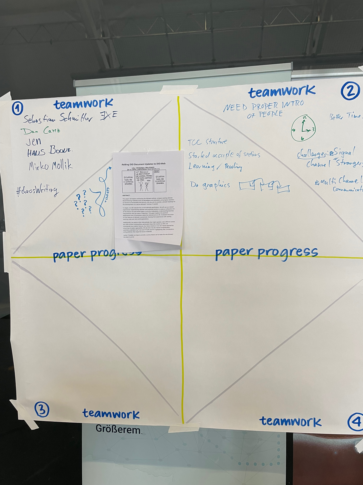
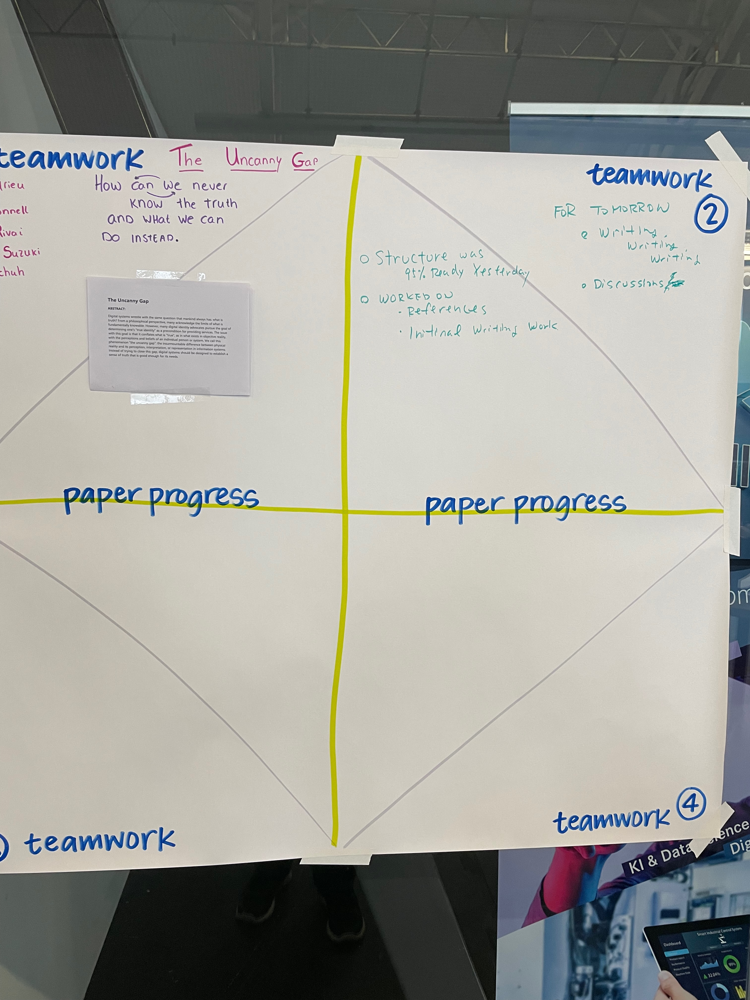
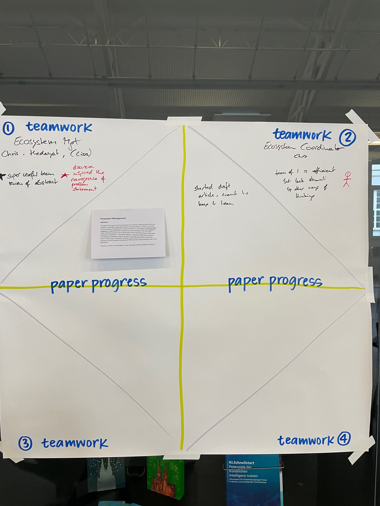
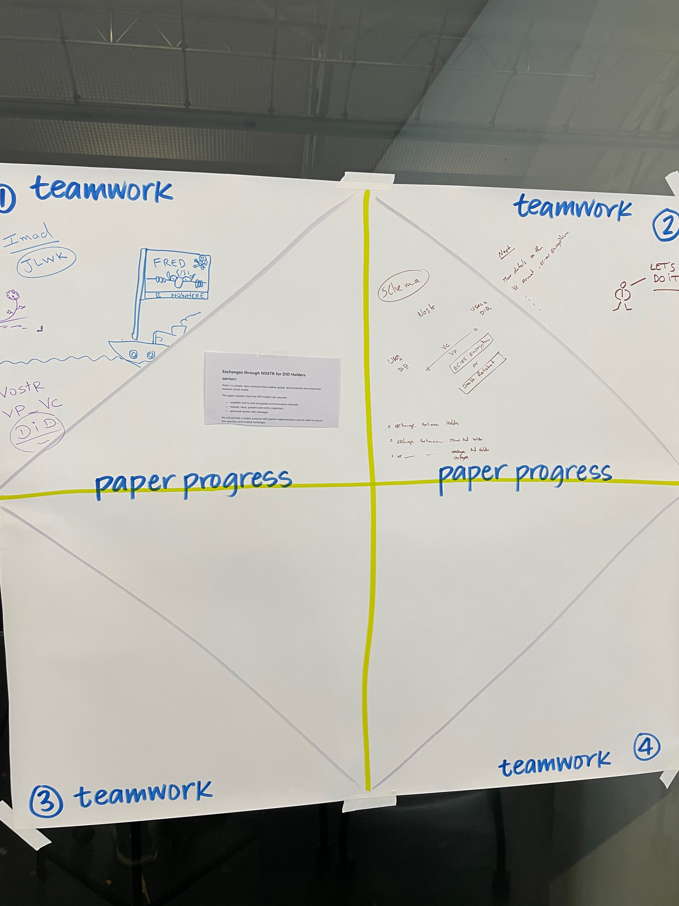
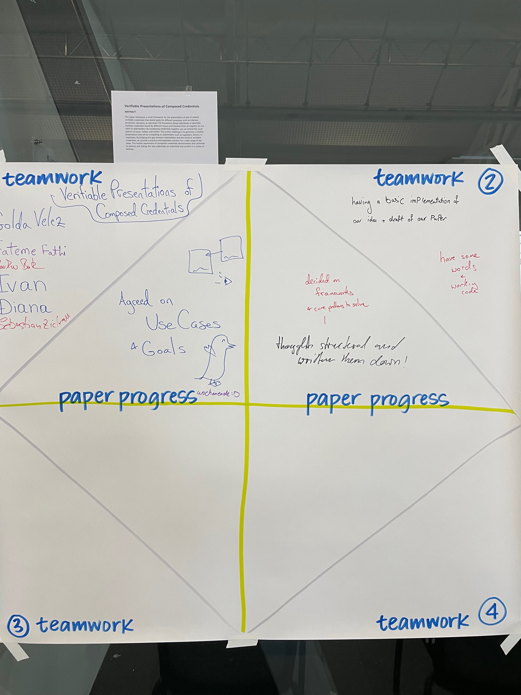
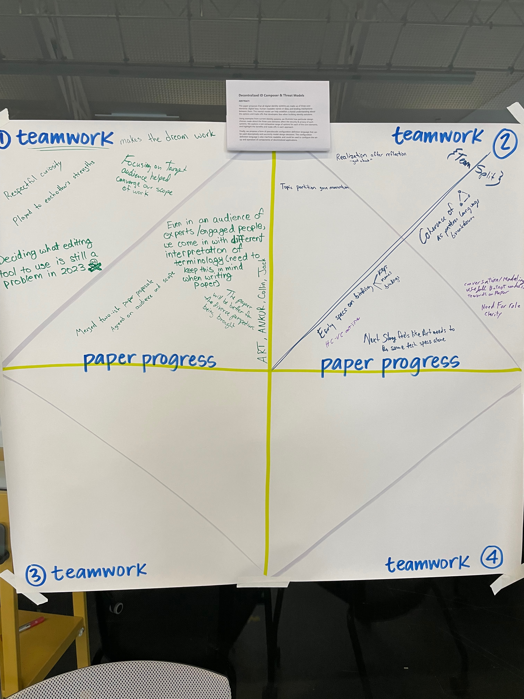

# End of Day Two

## Adding DID Document Updates to DID:Web

Worked on how to separate work so that it could be tasked out, and did individual tasks.
No section is complete, but different people are writing different sections.

## The Uncanny Gap

Made good progress, drafted the first few sections out of six.

## Ecosystem Management

Working as one person, but is writing, but could use insights from other people. 

Is going to talk to IDUnion people.

## DID Exchanges: True Nostr

Working to explain how to make the process work. How to use it with Nostr ID to encrypt. 

## Verifiable Presentations of Composed Credentials

Digging into core problem of how to combine two credentials & thinking about how to make a demo that allows for this sort of composition.

Started off with demo & talked about different technologies everyone is using
- wanted to get coding, but had discussion first

## Decentralized ID Composer & Threat Models

Have split efforts becauase they had different audiences. 

* ID Composer
* Threat Models (might become a Podcast episode)
     * Want to explore prior art
     * And offer takeaway for people not in the space

## Privacy Analysis of Singlevit vs Multibit Status Lists (Joe + Manu)

[still pending]
