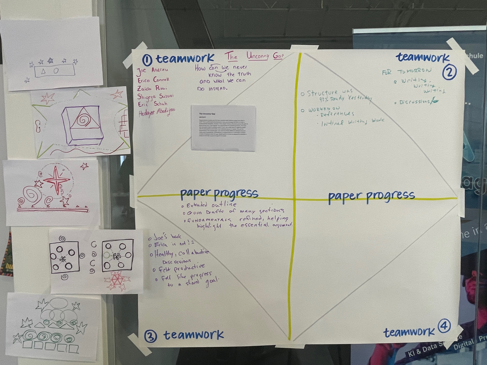
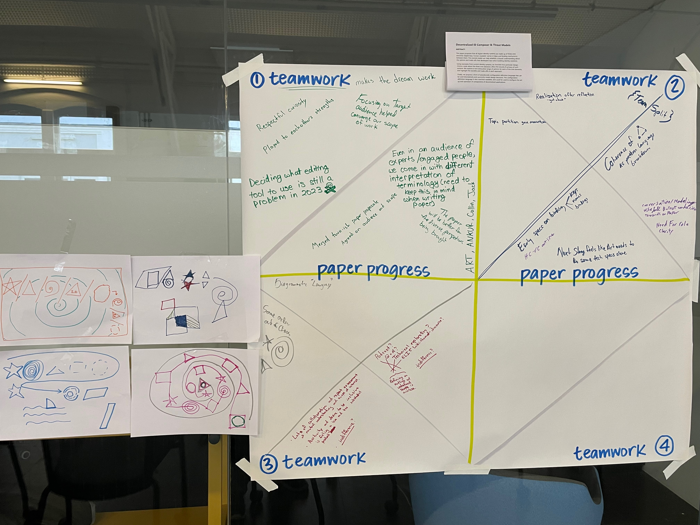
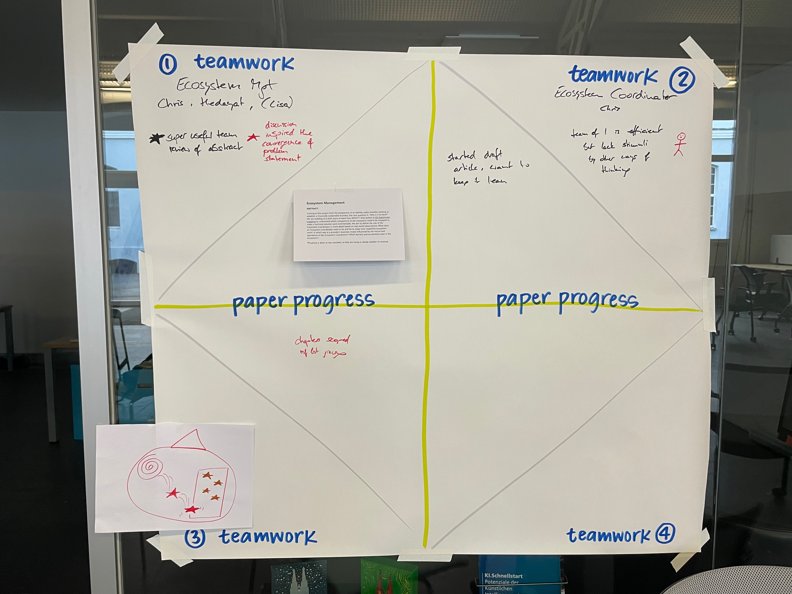
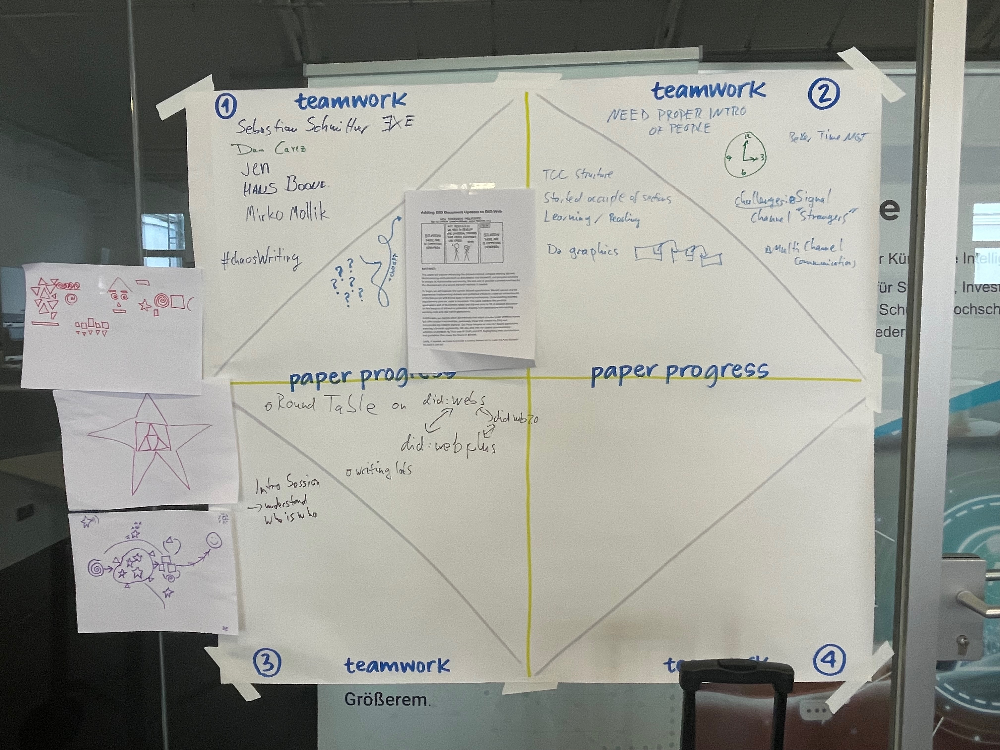
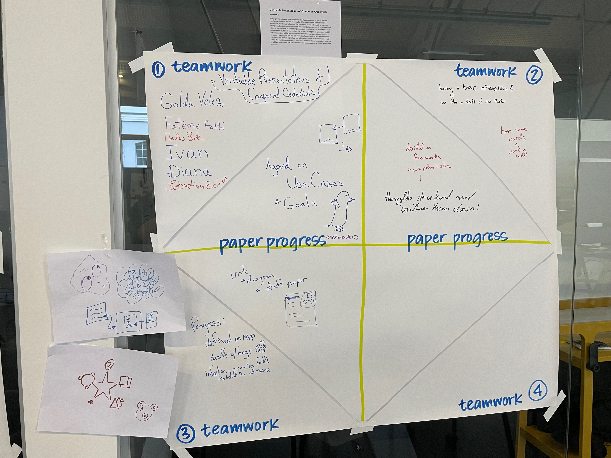
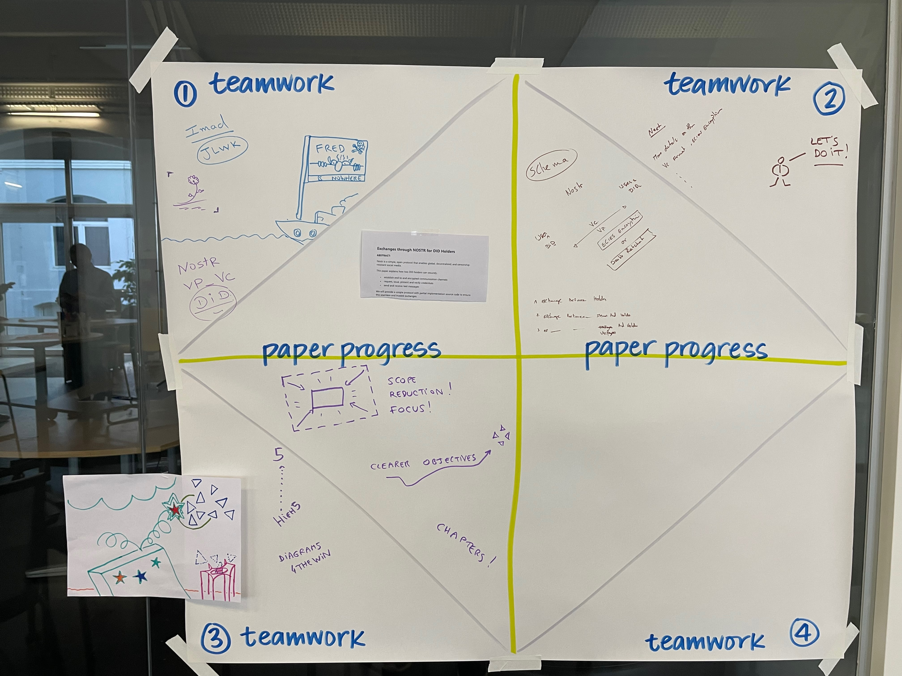

# Thursday Closure

We did an icon-based intepretation of our results so far.

## The Uncanny Gap

Some discussion of how ideas have changed, and that they're moving toward completion, but there's still a ways to go.

## Decentralized ID Composer & Threat Models

Even though this group has schismed, they're still happy with their progress and their goals. They still feel like personal connections are there.

(They have a shark swimming in the chaos pool: the GOAL SHARK.)

## Ecosystem Management

Drew about support of larger community.

## Adding DID Document Updates to DID:Web

Went from chaos (spirals) to support (squares), and question about completion (circle) or not.

## Verifiable Presentations of Composed Credentials

Figuring out what they don't know, whether there's chaos or order. 

## DID Exchanges: True Nostr

Chaos & change are accepted as positive, that they bring movement.

## Privacy Analysis of Singlevit vs Multibit Status Lists (Joe + Manu)

(still not actually here)

