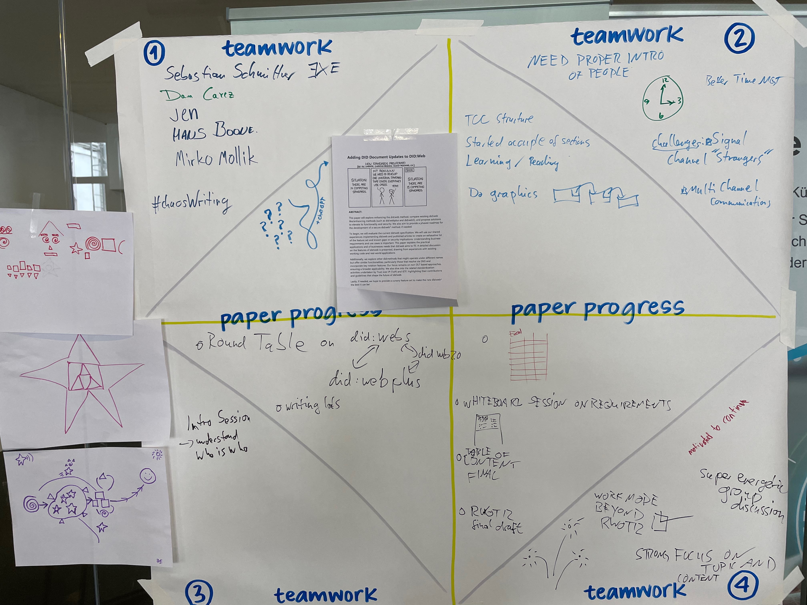
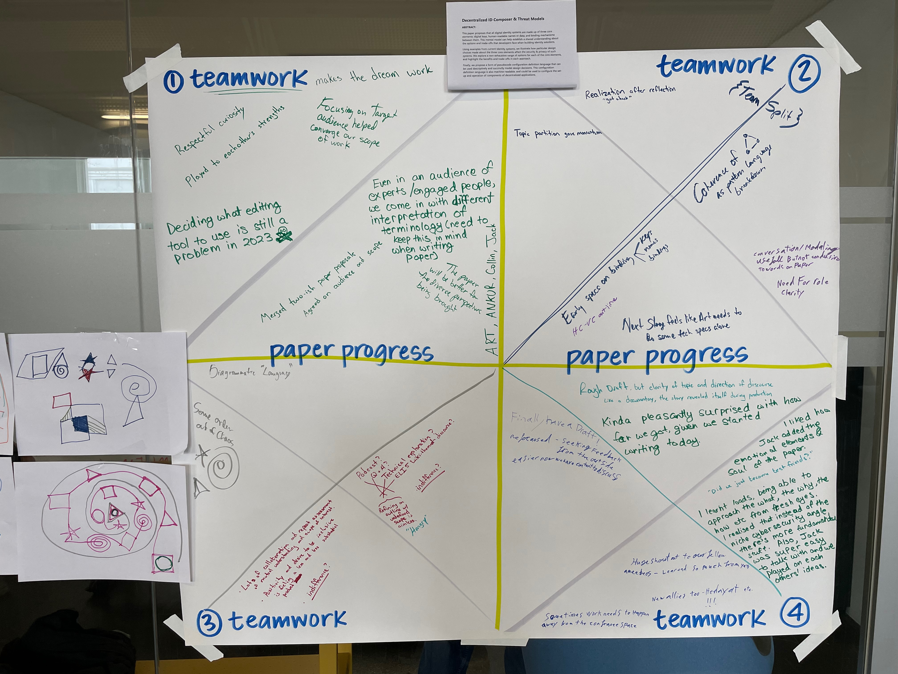
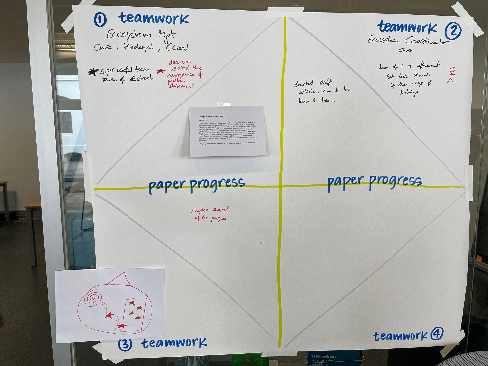
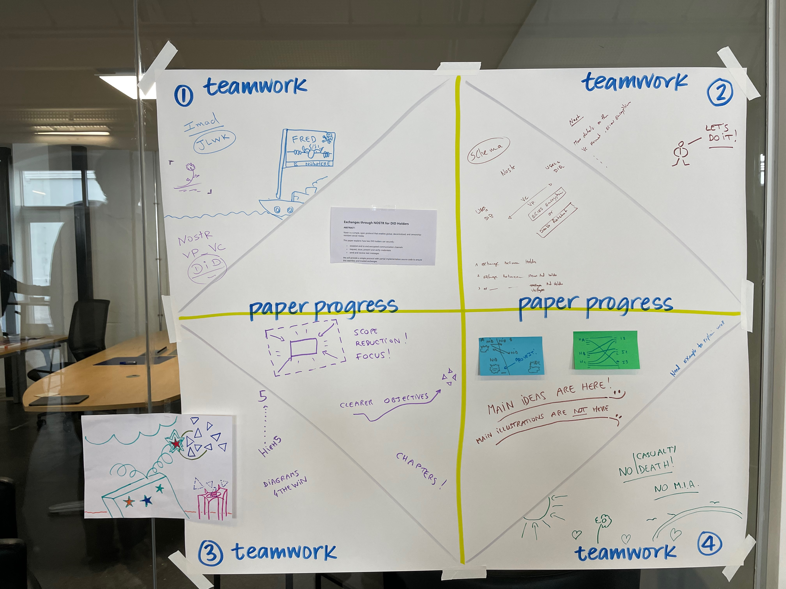
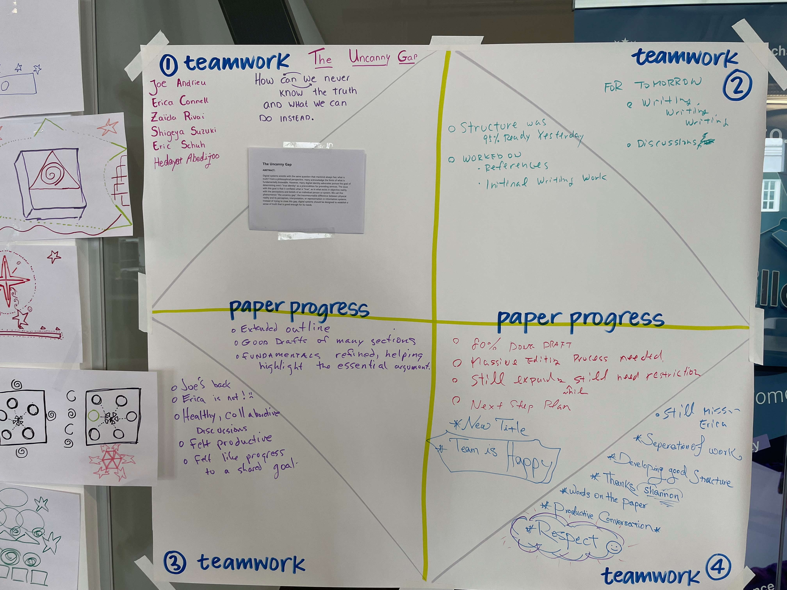

# Final Status

Here were the final team notes from RWOT12.

## Beyond DID:Web

## Composing Self-Sovereign Identity for Web3 Applications

## The Ecosystem Coordinator’s role in SSI ecosystem management

## Exchanges through NOSTR for DID Holders

## Leading with a Different Pitch: Data Portability, Rather Than Privacy

## Mind the Gap

## Verifiable Presentation of Composed Credentials

