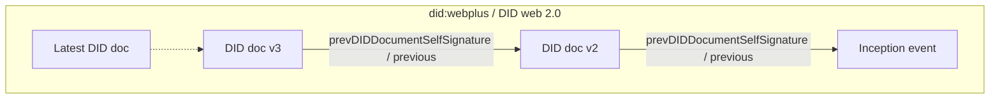
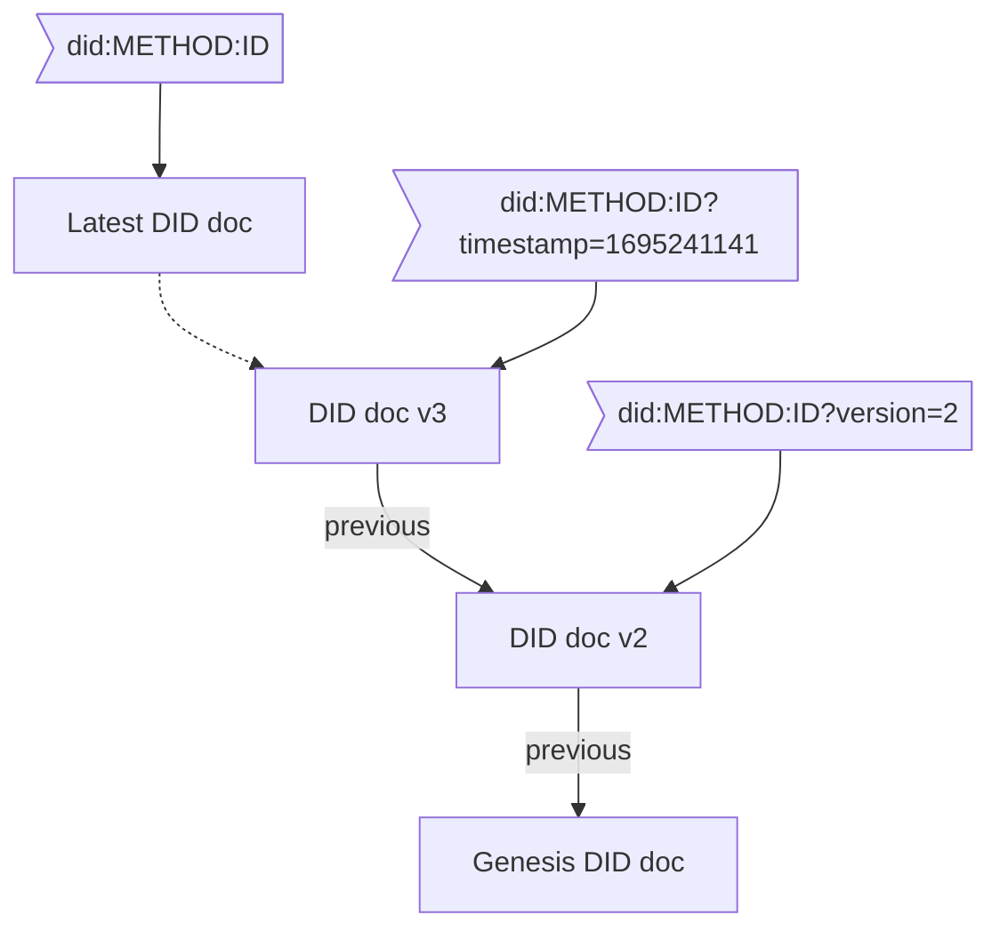

# Beyond did:web

**Responsible/Communicating Author:**

- Mirko Mollik <mirko.mollik@fit.fraunhofer.de>

**Authors:**

- Hans Boone <hans.boone@unifiedpost.com>
- Dan Carez <carezd@gmail.com>
- Dr. Sebastian Schmittner <sebastian.schmittner@eecc.de>
- Dr. Carsten Stoecker <carsten.stoecker@spherity.com>

## Abstract

This paper will explore a few recent suggestions for enhancing the `did:web`
method, in particular `did:webplus` and `did:webs`. Shortcomings of `did:web` are
analyzed and a list of necessary features to overcome real problems is
assembled. We strive to avoid the problem mentioned in the [classic xkcd comic on standards](https://imgs.xkcd.com/comics/standards.png) and
investigate whether the did:web method can be improved without creating
yet another (few) DID methods.

To begin, we will evaluate the current did:web specification. We will use our
shared experiences implementing did:web as well as published articles to create an
exhaustive list of the feature set and known gaps or security implications.
Understanding business requirements and use cases is important. This paper
explains the practical applications and businesses needs that did:web aims to
fill. A detailed discussion on the features of did:web is presented, drawing
from experiences with existing working code and real-world applications.

Additionally, we explore other did:methods that might operate under different
names but offer similar functionalities, particularly those that resolve via DNS
and incorporate key rotation features. Our focus remains on non-DLT based
approaches, ensuring a broader applicability. We also dive into the related
standardization activities undertaken by Trust over IP (ToIP) and IETF,
highlighting their contributions and guidelines that shape the future of
did:web.

Lastly, if needed, we hope to provide a cursory feature set to make the new
`did:web\*` the best it can be!

## Introduction

In the Introduction section, we embark on a detailed exploration of the
`did:web` method, beginning with its widespread adoption in organizational
contexts. We delve into why organizations are increasingly turning to did:web
for identity management, emphasizing its ease of use, simple discoverability,
and compatibility with existing web infrastructure. Following this, we
critically assess the main criticisms of `did:web`, highlighting its limitations
in trustworthiness, historical DID document resolution, and DID document
integrity. This examination sets the stage for the subsequent in-depth analysis
and discussion of potential improvements and alternative methods, providing a
foundational understanding of the current state and challenges of `did:web`.

### Why are organizations using did:web?

As organizations navigate the evolving landscape of identity management,
decentralized identifiers (DIDs) are emerging as a promising solution to enhance
security, privacy, and user control. Among the various DID methods available,
`did:web` serves as a practical starting point for those venturing into this
decentralized realm. Easy to implement and compatible with existing web
infrastructure, `did:web` enables organizations to familiarize themselves with
the core concepts of decentralized identities before diving into more complex
and specialized DID methods. Below, we explore the key advantages of starting
with `did:web`.

**Ease of Use:** `did:web` is often considered simpler to understand and
implement. It operates over standard HTTPS protocols and can be easily managed
with familiar, widely available, robust and cheap web server technology.

**Simple discoverability:** Compared to ledger-based DID methods, which may
require ledger-aware software not just for verification but even for basic
discovery, resolving a DID to its DID document for `did:web` is straightforward.
Discovering and resolving the `did:web` DID document relies on proven DNS
technology. Compared to standalone approaches like `did:key` and `did:jwk`, the DID
document can be requested by knowing only the identifier of the DID, reducing
the size of the id and allowing for the update of the DID document in the future.

**No Specialized Infrastructure:** Unlike DID methods that require
special nodes or decentralized networks, `did:web` works on existing web
infrastructure.

**Low Cost:** Unlike ledger-based DID methods, `did:web` does not have an
associated cost other than maintaining a web server.

**Interoperability:** `did:web` identifiers can be easily mapped to existing
HTTPS URLs, making it straightforward to integrate with current web
architectures.

### Main criticisms

Although `did:web` is easy to use and provides a good entry point for the
decentralized identity space, using `did:web` also has some limitations, the three
most prominent limitations being:

**No trustworthiness:** The main criticism of the `did:web` method for
decentralized identities is its inability to ensure trust for the
information it handles. While `did:web` is beneficial for publishing and
discovering DID documents, using familiar web mechanisms for this purpose is not
suited for evaluating their trustworthiness. The current web infrastructure is
rife with vulnerabilities such as website hacking, DNS hijacking, and unreliable
certificate authorities.

The `did:web` method relies on DNS and TLS as trust anchors. While DNS resolves the
domain name to an IP address and TLS secures the transport mechanism, they do
not necessarily enhance the trustworthiness of the information. TLS merely
verifies that the Fully Qualified Domain Name matches the common name in the
certificate. Various levels of assurance can be achieved through different types
of TLS certificates, ranging from `no assurance` with Let's Encrypt, to
`medium assurance` with extended validation certificates, and `high assurance`
with QWAC certificates.

Even with different levels of assurance offered by various TLS certificates,
this information is not factored into the trustworthiness of a DID document's
content. This is because in the current `did:web` method specification, the DID
document itself does not require information about the type of TLS certificate
and its corresponding level of assurance.

**Historical DID document resolution** If a private key linked to a `did:web` DID
document becomes lost, compromised, or outdated, it's essential to rotate the
existing keys and associate a new key with the DID. The goals of this key
rotation are threefold: to maintain the validity of prior signatures, to nullify
any signatures made with the faulty key, and to enable the DID controller to
produce new signatures using the updated key.

In the order to prove the validity of prior signatures it's essential to be able
to retrieve a DID document that was valid in a particular moment of time. In
order to prove that the controller is still the same, an immutable link between
the different versions of the DID documents is required.

While the `did:web` specification allows for key rotation and historical versions,
it doesn't fully address all of the issues mentioned above.

**DID document integrity** In the existing `did:web` specification, self-signing
the DID document is not mandated. As a result, it becomes impossible to
ascertain whether the content of the DID document is intact and unaltered or if
it has been compromised. The DID core specification has a feature for 
integrity validation using hashlinks. But this feature will only work when the
issuer of a verifiable credential does not update the DID document, otherwise
the hashlinks won't match anymore.

### Beyond did:web

This paper aims to critically examine the most glaring drawbacks of the current
`did:web` implementation: namely, the lack of trustworthiness, the absence of key
rotation mechanisms, and concerns about DID document integrity. To address these
limitations, we will analyze two existing works that attempt to rectify these
issues: the `did:webplus` and `did:webs` specifications. Through this analysis, we
will assess how these specifications tackle the inherent shortcomings of
`did:web`. Moreover, we will propose an alternative solution that enhances the
existing `did:web` specification in a fully compliant manner, targeting the
rectification of the aforementioned drawbacks.

## Feature requests: What is did:web lacking

The following section points out the features that are missing in the
`did:web` method.

### Cryptographic ownership binding

To prove the ownership of a DID, the owner performs a signature with the private
key that is linked to the DID. The verifier can verify the signature with the
public key that is published in the DID document. In cases such as `did:key` or
`did:jwk`, the public key is bound to the ID of the DID. The same goes for
`did:ethr`, where the verifier is able to validate the ledger. But `did:web` is
missing the binding between the ID of the DID and the public keys to prove
ownership. Here the owner or the controller of the DID document is the one who
has access to either the web server where the DID document is hosted or to the
DNS servers to point to another web server. The owner of these resources is able
to publish a new DID document and therefore to change the public keys. An
attacker could not get access to the old used private key of the DID, but
can hijack the identity to sign new credentials or authenticate to
other services with this ID.

On the other hand. this missing binding allows the owner to rotate the keys in
case he lost access to the current private key, similar to the typical "password
forget" functionality. Resolving the issue of being locked out by the private key is a feature
other DID methods such as `did:key` or `did:jwk` are missing. But as mentioned the
ownership to the DNS and web servers is a risk that has to be considered.

### Unique identifiers for the objects

Each element inside the DID document has to have a unique identifier, because it
needs to be referenced. In case a credential is signed by a key, the DID
document including the public key can also include multiple public keys. A X.509
certificate does not need a specific identifier for the public key, because the
certificate only includes one public key, so the identifier of the certificate
and the public key is the same. It is also not a good way to loop over all the
public keys in the DID document to check if the signature is valid with one of
them. Instead the public key will be referenced in the issued credential like
`did:web:example.com#key-1`. This will block the identifier `key-1` in the
future, because `did:web` is not supporting versioning of the documents. The
owner is unable to publish a new public key under the same identifier because it
would make the old public key unavailable. Other DID methods that support
versioning allow for the querying of a public key by the identifier and the version id or
time like `did:ethr:123456#key-1?versionId=2` and a new public key like
`did:ethr:123456#key-1?versionId=2`. This is important when a use case requires
you to publish a public key under a specific identifier. For use cases like
authentication this feature sounds irrelevant because you always need the latest
public key to verify the response. But in case of auditability, you want to query
older public keys to prove that the signature was valid at the time of issuance
without forcing you to store the public key in your own archive.

### did:web auditability

Audibitility goes beyond just a question of unique identifiers. In the area of software development for compliance solutions, the
integrity, transparency, and verifiability of data are foundational
requirements. Essential "compliance controls" such as Confidentiality,
Integrity, Availability, Non-repudiation, Attributability, Tamper-proof
Timestamping, Sequencing of Events, Long-term Archiving, and Proof Preservation
form the backbone of a robust compliance solution. These controls ensure that
sensitive information remains protected, actions are traceable to their sources,
and evidence of events or decisions is preserved for future reference or audits.
Specifically, the Auditability of DID documents plays a pivotal role in this
context.

It guarantees that every piece of data, once entered, remains transparent and
immutable, establishing a clear, verifiable record. This is especially vital for
the assertions issued by the controller of a DID in regulated industries where
the stakes for maintaining data integrity are exceptionally high, directly
impacting public trust, safety, and the bottom line. Thus, for software aiming
to provide compliance solutions, embedding these auditability features is not
just about meeting regulatory standards; it's about ensuring long-term trust,
security, accountability, and operational excellence.

`did:web`, while being easy to implement, has inherent limitations when it comes
to providing full auditability features for the entire DID lifecycle, especially
concerning key rotations and DID document configuration events.

Here's why:

- **Centralized Nature:** `did:web` identifiers are essentially URLs, and they rely on
  the traditional web infrastructure. This means that the data is stored on
  centralized servers or web domains. In decentralized systems such as blockchains the information get
  published on multiple servers that are not controlled by a single stakeholder.
  An end user is able to query multiple endpoints and can verify if he/she got
  equal results.  Also, all the information is publicly
  available to read for everyone, providing more transparency. None of these features
  are necessarily available in centralized web infrastructure.
- **Lack of Immutable History:** In decentralized ledger systems, every change or
  transaction is recorded in a way that it cannot be altered, ensuring a
  permanent and transparent history. Immutability is created
  by linking the transactions in a chain, removing centralized ability to update
  peristent data.  `did:web`, due to its reliance on the
  traditional web, doesn't inherently provide this feature. If a DID document is
  updated or a key is rotated, the previous state might be overwritten without
  any immutable record of the change.
- **Vulnerability to Tampering:** Since `did:web documents` are hosted on web servers,
  they are susceptible to common web vulnerabilities. Malicious actors, if they
  gain access, can alter or delete historical data, making it challenging to
  audit the entire lifecycle of the DID.
- **Dependence on Web Hosting Providers:** The availability and integrity of `did:web`
  documents are tied to the reliability of web hosting providers. These
  providers can experience downtime, data losses, or even decide to terminate
  services, leading to potential loss of historical data.
- **Absence of Native Timestamping:** Unlike some decentralized systems that
  inherently timestamp every transaction, `did:web` doesn't offer tamper-proof
  timestamping. This makes it impossible to verify the exact sequence and timing
  of events in the DID's lifecycle.
- **Potential for Data Inconsistency:** Without a decentralized consensus mechanism,
  there's a risk of data inconsistency in `did:web`. Different servers might have
  different versions of a DID document, complicating the audit process.

#### Achieving Long-Term Non-Repudiation

Integrating self-certifying identifiers with a robust microledger enhances the
`did:web` method, transforming it from a rudimentary system to a comprehensive,
auditable solution that includes timestamping and sequencing of DID document
configuration events.

By storing snapshots of this microledger on an immutable, publicly accessible
platform like "git", vulnerabilities such as deletion and duplicity attacks can
be effectively countered, ensuring long-term non-repudiation.

Achieving long-term non-repudiation involves:

- Taking snapshots of the microledger at regular intervals, such as every 15
  minutes.
- Storing each snapshot in a git repository.
- Ensuring the system's resilience, even in scenarios like company bankruptcy.
- Digitally signing each snapshot for added security.
- Granting all partners and auditors access to the `did:web` operator's git
  repository, allowing them to clone and retrieve the microledger whenever
  necessary.

This methodology is accepted as a compliance solution in Germany and is
considered to ensure long-term non-repudiation as an interim solution for
productive systems.[2]

#### More on Long-term Non-repudiation

KERI's introduction of witness networks offers a more abstract and sophisticated
approach for achieving long-term non-repudiation. However, its implementation
can be more challenging compared to the aforementioned method.

Adding self certifying identifiers and a robust microledger to `did:web`
transforms `did:web` from a very basic approach to an auditable solution including
tamper-proof timestamping and sequencing of DID document configuration events.

When snapshots of such a micro-ledger are stored on an immutable, publicly
accessible system such as "git", deletion and duplicity attacks can be mitigated.
KERI introduced the concept of witness networks which is a more abstract and
advanced approach.

This combination leverages the ease of web-based systems with the
trustworthiness, security, and transparency of decentralized ledgers. It
addresses the inherent challenges of the traditional `did:web` method, offering a
more robust and reliable solution for digital identity management.

## Solving Problems

In the next section, we address the key challenges of the `did:web` method. We
begin by exploring efficient strategies for key rotation, highlighting the
importance of maintaining key histories and versioning. Next, we discuss the
implementation of a micro-ledger approach for DID Document Versioning. We
conclude with an examination of embedding self-signatures and enhancing DID
document validation, focusing on maintaining integrity and trustworthiness
within the system.

### Key Rotation

When [the private key of a DID becomes unusable](#Private-Key-gone-bad), the DID
document needs to be updated to publish a new public key. In order to fulfill
the [requirements listed above](#Private-Key-gone-bad), the old private key must
still be accessible, but it must be made clear during which time period
signatures are still to be considered valid and at what point they are to be considered
invalid.

Having a version history of keys inside a DID document with published validity
intervals is a perfectly valid solution to this problem and could be achieved by
simply adding `valid-from` and `valid-until` time stamps to the DID documents
verification methods. (See
[did core specification of verification methods](https://www.w3.org/TR/did-core/#verification-methods))

However, since key rotation is only one reason to change a DID document, we
conclude that rather than coming up with a way to only having a version history
of keys, we would rather have
[versioned DID documents](#Did-Document-Versioning).

### Did Document Versioning - Micro-Ledger Approach

The best:tm: approach to versioning is what is nowadays known as a "micro
ledger", i.e. hash-linked data blocks. Notice that this is the data structure
used in a block chain, but none of the methods discussed in this paper actually
requires a distributed ledger to store/share the data.

- `did:webs` uses KERI to have this micro ledger in form of an KERI event log.
- The `did:web2.0` proposal has the backward links as resolvable DID URIs,
  including the hash (id), which are placed directly in the DID document in a new `"previous"`
  field.
- `did:webplus` links to the previous DID document by including a
  `prevDIDDocumentSelfSignature` field, which is the most traditional form of
  linking blocks (e.g. in the bitcoin data structure).


In the `did:webs` approach (above), the DID documents are generated by processing the full
or partial KERI log. To get a historical version by version id/time stamp, only
the KERI log up to this time/version is processed, to generate the historical DID
document. The DID documents themselves do not maintain any of the micro-ledger
structure in `did:webs`.



In contrast, `did:webplus` builds the micro ledger directly from the DID
documents. The DID web 2.0 proposal is very similar to `did:webplus` in this
respect.

#### Referencing versions

We have to distinguish between

- The DID being an identifier of an entity (person/organization/thing/...)
- The DID being a resolvable URI that yields a DID document
  - The DID document at least associates public key(s) with the DID
  - Usually the DID document also publishes service endpoints that allow others
    to discover how to interact with the DID's subject

When the DID is used to refer to a DID document, mentioning the version of that
document might be necessary. This could be specified in the form of a version
number/hash id. (See
[naming things with hashes](https://www.rfc-editor.org/rfc/rfc6920.html) for the
general idea. There a lots of concrete variants on the theme.)

A very important use case for accessing a historical DID document is this: When
verifying a credential, the verifier most likely does not want to get the latest
version of the issuer's DID doc, but the version that was current at the time he
issued the credential. So after requesting the DID document, the following
checks need to pass:

- the issuance date of the credential is after the `createdAt` date of the DID
  document of the issuer, to ensure that the DID document was already valid at
  the time of issuance
- the next DID document issuance date has to be greater than the issuance of the
  credential. This ensures that the key was not revoked at the time of issuance.
  There could be the case that the key is still in the new version of the
  document resulting in a valid signature. But then the correct usage version
  information was not provided by the issuer. In case there is no next version,
  the current version is the latest one and the key is still valid.



## Summary of `did:web` improving DID methods

This section introduces existing proposals that aim to solve some of the
limitations of `did:web`.

### did:webs

The `did:webs` method [3] aims to benefit from the discoverability of `did:web`
while providing a separate trust anchor based on KERI (_Key Event Receipt
Infrastructure_) [5].

`did:webs` identifiers follow a structure similar to `did:web`, with an
additional KERI _Autonomic Identifier_ (AID) appended at the end, for example:
`did:webs:example.com:some:path:12124313423525`

In KERI, an inception event creates the initial key pair that establishes the
root of trust, and the _Autonomic Identifier_ (AID) is derived from the
inception event's hash. The AID is self-certifying and becomes the first item in
an append-only chain of events known as the _Key Event Log_ (KEL). The KEL
provides a secure mechanism to perform updates in the DID document that are
chained together and can be validated against the inception event that is
encoded in the DID itself.

Like `did:web`, `did:webs` uses the HTTPS protocol to provide access to DID
documents. URLs are constructed using the domain name and path in the form
`https://domain.tld/some/path/aid`, then appending `/did.json` to obtain the
latest version of the DID document. Additionally, `did:webs` publishes the
entire stream of KEL events on a separate URL (`/keri.cesr`), making it possible
for DID resolvers to reconstruct and validate the content of the DID document at
any point in time.

Since the AID represents the inception event tied to the subject's identity, the
AID together with the KEL are sufficient to generate the DID document associated
with the subject, independently from the `did:webs`'s DID itself. This property
makes it possible to, for example, migrate a `did:webs` to another web domain,
or even to another DID method by using the AID as the unique identifier and the
KERI event stream for validation. From this perspective, `did:webs` could be
seen as a method for exposing a set of KERI mechanisms via HTTPS.

### did:webplus

The `did:webplus` method [4] augments `did:web` by maintaining an immutable and
auditable history of DID document versions.

This is realized by implementing a micro ledger in which the signature of the
initial document is incorporated into the DID itself, with each subsequent
document referencing the signature of its predecessor. Documents also contain
additional attributes, including a monotonically increasing _version number_ and
a _start of validity_ timestamp, which effectively establish a totally ordered
sequence of DID documents with non-overlapping periods of validity.

Identifiers in `did:webplus` are similar to the ones in `did:web`, with an
additional field corresponding to the self-signature of the initial document,
for example:
`did:webplus:example.com:0B2LYBZ06Bn0dq7ALo3kG5ie20sQKvv7yzmbA8KtKExC4PRiZ2io-hPxxOy-mQ2qb4yuGdAK0eKvipqcBlZSArDg`.

When the DID controller produces a signature, the DID URL specifying the signing
key must include the standard query parameters `versionId`, `versionTime` and
`hl` [6]. This uniquely identifies the document version within the ledger.

To our knowledge, a draft method specification of `did:webplus` has not yet been
published, but an overview of the method and a prototype implementation are
available [4].

#### Embedding self-signatures

To uniquely identify and link document versions, a self-signature of the
document content is computed and embedded in the document itself. This creates a
circular dependency problem: the signature should only be computed once the
content will not be further modified, so it is not possible to then modify the
document to include the signature inside it.

`did:webplus` solves this problem by reserving "slots" in the document that are
filled with zeroes. The signature is then generated on this data, and the zeroes
are then replaced with the computed signature to build the final self-signed
structure. During the signature verification process the inverse operation is
performed, extracting the signature first, then filling the slots with zeroes
and computing the signature.

## DID Web with attached validation

During the Rebooting Web of Trust event we also tried to find a way to make the
DID documents verifiable without breaking the actual schema of a valid `did:web`
document, like `did:webplus` is doing. Another requirement was to only use
technologies that already have a high adoption.

The `did:web` can be used either as the issuer in the credential or as the
holder/owner.

### Using the DID to identify the issuer of a verifiable credential

In this case, the verifier needs access to the public key, even when the private
key is not actively used to sign new credentials anymore. To make this possible,
the issuer has to add either the
[versionId](https://www.w3.org/TR/did-spec-registries/#versionId-param) or
[versionTime](https://www.w3.org/TR/did-spec-registries/#versionTime-param)
[query parameter](https://www.w3.org/TR/did-core/#did-parameters) to its
identifier. It would look something like this: `did:web:example.com?versionId=2`
or `did:web:example.com?versionTime=2023-09-21T10:08:26.047Z`. This allows us to
have multiple versions of a DID document and therefore to update the key
material or the service points.

To guarantee the
[content integrity protection](https://www.w3.org/TR/did-core/#content-integrity-protection),
the issuer adds a
[hashlink](https://datatracker.ietf.org/doc/html/draft-sporny-hashlink-05) of
the DID document to the identifier. The final identifier looks like this
`did:web:example.com?versionId=2&hl=zQmWvQxTqbG2Z9HPJgG57jjwR154cKhbtJenbyYTWkjgF3e`.

After checking the integrity of the DID document, we need to make sure that the
used public key was valid during the issuance process. Compared to other
formats, like X.509 certificates, DID documents do not have fields defining the
lifespan of a DID document and the validity of the content. To solve this
problem, we can use the
[DID document metadata](https://www.w3.org/TR/did-core/#did-document-metadata).
In this object the field
[nextUpdate](https://www.w3.org/TR/did-spec-registries/#nextupdate) can include
a time stamp. If so, a newer version of the DID document exists and this time
stamp has to be compared with the issuance date inside the credential. If the
date inside the credential is greater than the date of the `nextUpdate` field,
the signature is invalid. To query the metadata, we need to add a service
endpoint to the DID document like:

```
{
  "service": [
    {
      "id": "did:web:example.com#metadata",
      "type": "didDocumentMetadata",
      "serviceEndpoint": "https://example.com/metadata"
    }
  ]
}
```

A `versionId` or `versionTime` query can be passed to the endpoint to get the
DID document metadata for a specific version. If none is passed, the metadata
from the latest DID document are returned. The type `didDocumentMetaData` is not
yet included in the
[DID spec registry](https://www.w3.org/TR/did-spec-registries/#service-types).
Using the metadata endpoint we are not required to define the `versionId` as an
incrementing number to discover the next version. The value
[nextVersionId](https://www.w3.org/TR/did-spec-registries/#nextversionid) is
giving us this information we need to request the next version if there is any.
If we get none, we can be sure that we have the latest version of the DID document.

Using only the already defined parameters from the did-core, we don't need to
add extra fields to the DID document. So being compliant to the schemas
`"https://www.w3.org/ns/did/v1", "https://w3id.org/security/suites/jws-2020/v1"`
that are used by the `did:web`, we are not forced to create a new DID method
like `did:webplus` It also reduces the the required requests we need to make to
the server, since we only request one version of the DID document and its
metadata.

### Using the DID as the holder of verifiable credential

The method can also be used for the holder binding when issuing a credential.
Since `did:web` allows for the update of the DID document, the holder is able to perform
key rotations to get rid of compromised keys. When binding a credential to a
holder (or more generally using the holder's DID as a reference to the holder
anywhere) the un-versioned DID should be used, exactly as `did:web` is used today.
When the identity of a holder (or any person) at the present time of the
validation is to be checked, sending the DID without a version specification and
hence receiving the most up to date DID document is appropriate.

For added security, the issuer of a holder-bound VC might add a version + hash
link parameter to the DID and use this as the subject ID, hence signing that he
checked that a certain version of the DID document belonged to the holder DID. This
enables the verifier to check that there is a certificate chain going back from
the current version of the DID document to the one that was committed in the VC.
This chain of certificates is build of JWTs, each one signed with a valid key
from the old DID document and referring to the next DID document via a hash
link:

```
Payload
{
  // hashlink of the next version, in this case version 8
  "sub": "c4c09b07e9c46fae3d53bc9282425d0a8b4025e0dbce2a8dc176ce1912c88983",
  // reference to the key used for signing
  "iss": "did:web:example.com?versionId=7#key-0"
}
```

We do not need to include a hashlink in the issuer reference since we already
validate this document. To follow the principles of least privilege we can limit
the usage of possible keys by defining that these credentials should be signed
by a keys that is in the list for
[authentication](https://www.w3.org/TR/did-core/#authentication). To get access
to the signed credentials, one more service endpoint has to be defined where the
credentials are stored:

```
{
  "service": [
    {
      "id": "did:web:example.com#proofs",
      "type": "UpdateProofs",
      "serviceEndpoint": "https://example.com/proofs"
    }
  ]
}
```

The endpoint will either return a list of all proofs or just the proof that is
required to validate the next version. In case one of the signature is invalid,
the whole chain of trust is broken and the validation process has failed.

### Known drawbacks

The storage of DID documents needs more space than just storing the changes in
case only one key is rotated but the other nine keys are still included. Is is a
downside for the owner of the DID but also for the holder. It has to request all
DID documents step by step instead of downloading all DID documents in a list.
This could be done via another service endpoint, requesting a list of DID
documents and proofs so that it can be validated online.

In some scenarios the amount of validation can be huge when the holder had made
a lot of key rotations after it got its credential. For this case it would be
more effective to make jumps in the chain of versions. But to do so, the owner
has to sign a claim that version five is in the trust chain of version two, when
it got signed by a key of version two. But this would violate the lifespan of
the key from version two since it got rotated when creating version three. And
it's also not good practice to not rotate the key that is allowed to update a
DID document.

## Outlook / Future Research

In this paper we did a high level comparison of the `did:webs` and `did:webplus`
methods and compared them to what we think would be possible to achieve with
augmented `did:web` alone. We deliberately did not do a deep comparison of e.g.
performance KPIs of the involved algorithms, neither is this a solid security
analysis of any of the mentioned methods. Such a more thorough analysis of the
methods is left for future research.

## Acknowledgements

We would like to thank Dmitri Zagidulin, Benjamin Goering, and Juan Caballero
for writing
[the advance reading paper "DID Web 2.0" for RWOT 12](https://github.com/WebOfTrustInfo/rwot12-cologne/blob/main/advance-readings/did-web-2.0.md),
which sparked the work on this paper at RWOT 12.

We would also like to thank all the organizers of RWOT 12 for organizing and
facilitating this great conference, which enabled us to work on this paper.

## References

[1] did:web method https://w3c-ccg.github.io/did-method-web/  
[2] https://yes.com/docs/qes/2.5/index.html#_long_term_non_repudiation [3]
did:webs method
https://trustoverip.github.io/tswg-did-method-webs-specification  
[4] did:webplus method https://github.com/LedgerDomain/did-webplus  
[5] Key Event Receipt Infrastructure (KERI)
https://weboftrust.github.io/ietf-keri/draft-ssmith-keri.html  
[6] Did Core W3C Specification https://www.w3.org/TR/did-core/
